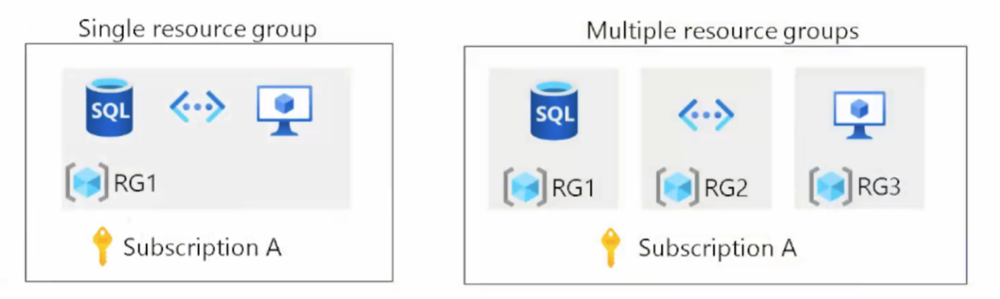

# Resumo

Primeira aula de AZ-305: Designing Microsoft Azure Infrastructure Solutions

• Design para governança

• Design para grupos de gerenciamento

• Design para assinaturas do Azure

• Design para grupos de recursos

• Design para marcação de recursos

• Design para Azure Policy e RBAC

• Design para Azure Landing Zones

# Management groups 

https://learn.microsoft.com/en-us/azure/governance/management-groups/overview

# Management Subscriptions

São componentes lógicos para gerir faturamentos, limitar custos.

https://learn.microsoft.com/en-us/azure/cloud-adoption-framework/ready/landing-zone/design-area/resource-org-subscriptions

Aqui teve uma demo sobre como fazer lock do tipo delete em resource group

## Elegible assigments

https://learn.microsoft.com/en-us/azure/role-based-access-control/role-assignments-eligible-activate

Aqui eu fiquei umas 2 horas fazendo lab, e fazendo RBAC e Policies...

Quando combinar com o Azure Policy, você pode criar uma política que não permite a criação de recursos em regiões específicas. Isso pode ser útil para evitar custos desnecessários ou garantir que os recursos sejam criados apenas em regiões onde sua empresa tem presença.

# Landing Zones

O Objectivo é ter um espaço onde o proprio utilizadors pode criar os recursos.

https://learn.microsoft.com/en-us/azure/cloud-adoption-framework/ready/landing-zone/

