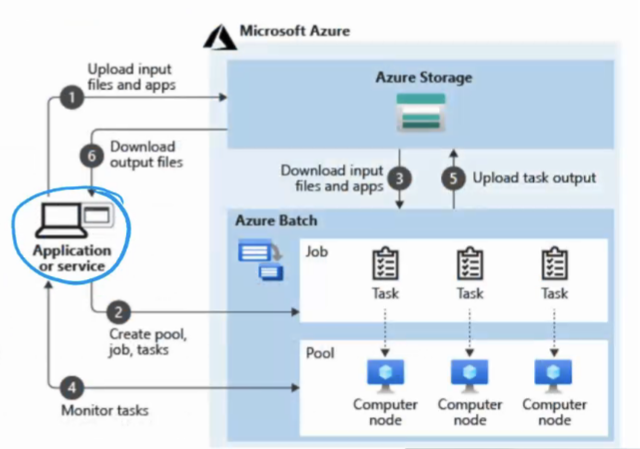

# Resumo
## Design a Compute Solution

Uma árvore de decisão pode ajudar arquitetos a escolher o serviço adequado com base no cenário e nas necessidades do cliente.

### Quando usar Virtual Machines

- Entenda o cenário e saiba quando o uso de Virtual Machines é apropriado.
- Escolha o SKU correto para atender ao problema que está sendo resolvido.

### Planejamento de uma VM no Azure

1. **Configuração de Rede**: Defina sub-redes, regras de segurança, etc.
2. **Nomeação**: Escolha um nome para a VM.
3. **Localização**: Selecione a região onde a VM será criada.
4. **Armazenamento**: Determine o tipo de armazenamento necessário.
5. **Sistema Operacional**: Escolha o sistema operacional adequado.
6. **Manutenção**: Mantenha a VM atualizada.
7. **Monitoramento**: Configure o monitoramento para a VM.

### Fluxo de Decisão

1. **Início**: Decida entre criar uma nova VM ou realizar uma migração (lift-and-shift).
2. **Nova VM**:
    - Precisa de controle total?  
      - **Sim** → Use Virtual Machines.
3. **Migração**:
    - Pode ser conteinerizado?  
      - **Não** → Use Virtual Machines.  
      - **Sim** → É um app Web/API?  
         - **Não** → Use Virtual Machines.

👉 Sempre que flexibilidade, controle ou impossibilidade de conteinerização forem necessários, a recomendação é usar Virtual Machines.

## Scale Sets

Isso é muito usado para aplicativos que precisam de escalabilidade horizontal. O Scale Set é um recurso que permite criar e gerenciar um grupo de VMs idênticas. Isso é útil para aplicativos que precisam de alta disponibilidade e escalabilidade.

# Azure Batch

Ele é um serviço para escala massica em paralelo. Recebe os jobs, e distribui as tarefas entre os nós.

# Azure Kubernetes Service (AKS)

• Enterprise scalability

• Automatic cluster node and pod scaling

• Granular network control

• Cluster node upgrades

• Storage volume support

• Ingress with HTTP application routing support

• Private container registry

Aqui fala um pouco de update de instancias, rolling update, self healing, e etc.

Gere rede, cada nó tem vários containers, gestão do storage e IP.

Moto de jobs, Auto Scaling...

# Azure Functions

É um serviço serverless que permite executar código sem precisar se preocupar com a infraestrutura por tras.

## Azure logic apps

Low code, para criar workflows.

https://learn.microsoft.com/en-us/azure/logic-apps/logic-apps-overview

