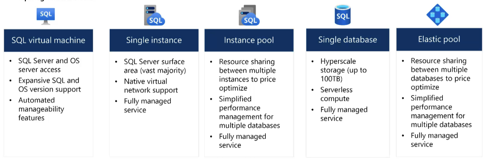
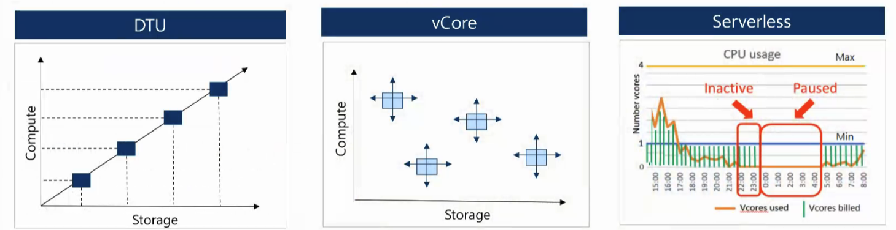
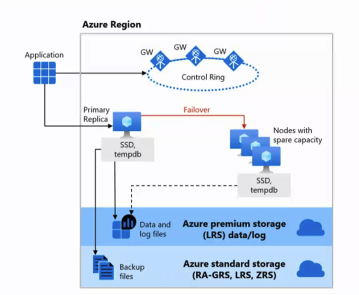
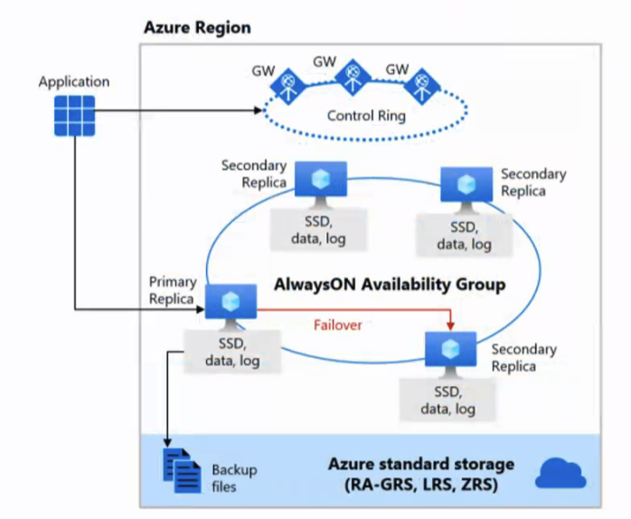
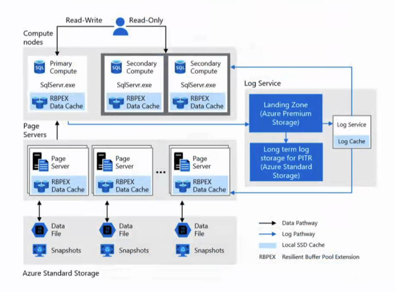
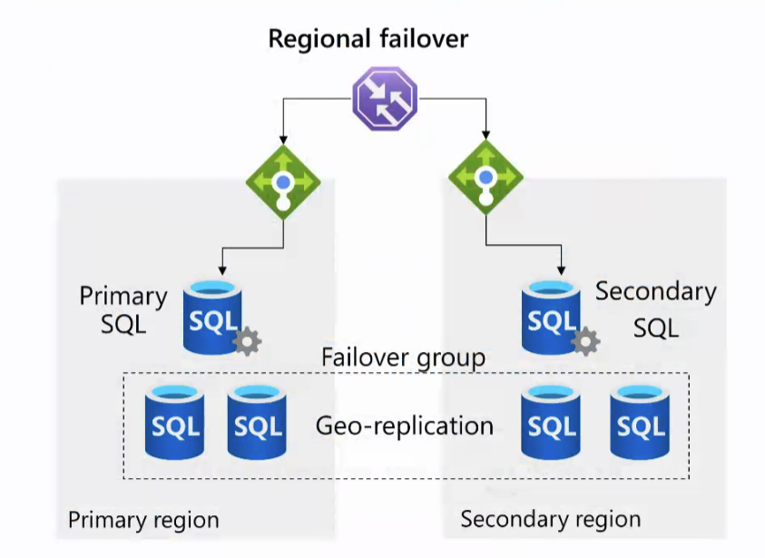
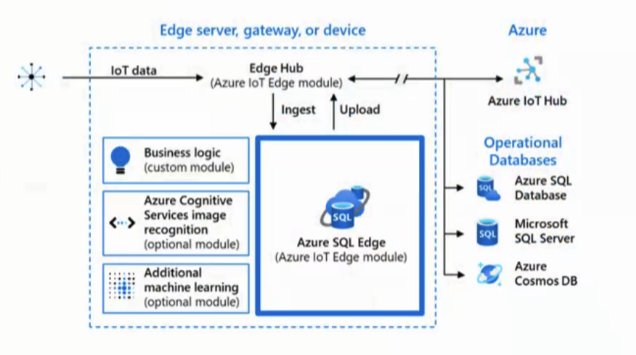
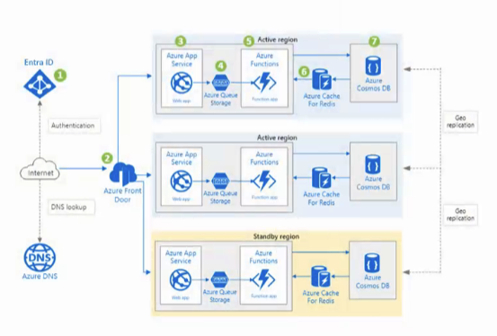
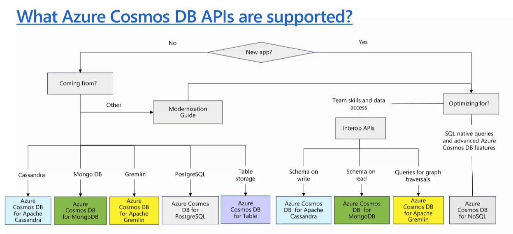
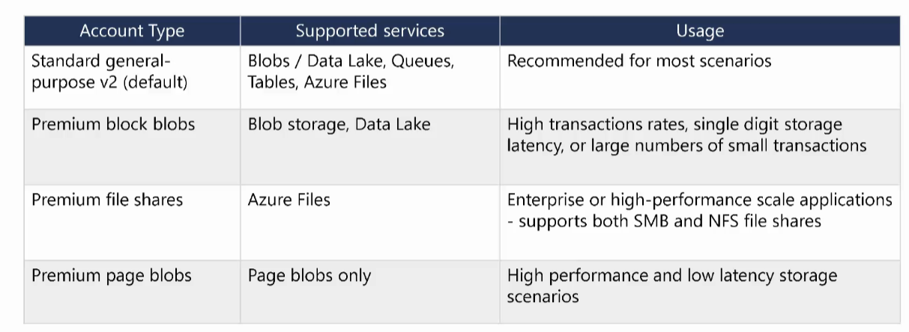

# Resumo

# Design a non relational data storage solution

- Dados estruturados

- Dados não estruturados

- Dados semi-estruturados

# Tipos de discos

- Sata3

- SSD

- SSD ultra

- NvME1

- NvME2

- Archive

Para projetar o armazenamento no Azure, primeiro é necessário determinar o tipo de dados que você possui.

• Dados estruturados incluem dados relacionais e possuem um esquema compartilhado

• Dados semi-estruturados são menos organizados do que os dados estruturados e não são armazenados em um formato relacional

• Dados não estruturados são o tipo de dados menos organizado

# SQL

SQL costuma ter grande I.O

Modelos de preço Azure SQL Database

Falamos alguns pontos de Alta Disponibilidade

Hyperscale

RCA - Root Cause Analysis

RCA é uma técnica usada para identificar a causa raiz de um problema. É uma abordagem sistemática para entender por que um problema ocorreu e como evitá-lo no futuro.

# Failover

Failover é o processo de alternar automaticamente para um sistema de backup, dispositivo ou rede quando o sistema primário falha ou é interrompido.

# Estratégia de Database

- Grupo de failover automático  

- Hyperscale

- Crítico para negócios  

- Instâncias gerenciadas  

- Pools elásticos do SQL  

- SQL Server em uma VM  

- Banco de Dados SQL  

- Preços baseados em vCore  

- Always On  

- Preços baseados em DTU  

# Estrutura

Precisamos primeiramente pensar em segurança:

## NETWORK SECURITY

VNet, Firewall Rules, NSG, Private Link

## IDENTITY AND ACCESS MANAGEMENT

RBAC, Azure AD, Managed Identity, Row level security   

## DATA PROTECTION

Encryption, Backup, Disaster Recovery, dynamic data masking

## SECURITY MANAGEMENT

ADVANCE THREAT PROTECTION, Security Center, SQL Audit, Vulnerability Assessment, Microsoft Defender for Cloud

# Recursos
## Recursos do Azure SQL Database

Consulta entre bancos de dados (Cross Database Query)

Servidores vinculados (Linked Servers)

Acesso ao nível do sistema operacional (OS Level Access)

Serviços de Integração do SQL Server (SSIS)

Replicação geográfica ativa (Active Geo-Replication)

Serviços de Relatórios do SQL Server (SSRS)

Suporte a versões antigas do SQL Server

Serviços de Análise do SQL Server (SSAS)

Suporte nativo a redes virtuais (VNet)

Backup automatizado

Objetivo:

Necessidade de decidir qual serviço do Azure usar com base nesses requisitos:

- Azure SQL Database

- Azure SQL Managed Instance

- SQL Server em Máquina Virtual (VM)

dependendo dos recursos necessários, o tipo de serviço ideal no Azure muda. Por exemplo, se você precisa de acesso ao sistema operacional ou suporte total a SSRS/SSIS/SSAS, provavelmente precisará usar SQL Server em VM. Já para recursos mais gerenciados e modernos, o Azure SQL Managed Instance pode atender.

# Azure SQL Edge

# Azure Cosmos DB

Um serviço de banco de dados NoSQL totalmente gerenciado para desenvolvimento moderno de aplicativos

Possui tempos de resposta de milissegundos de um dígito e velocidade garantida em qualquer escala.

Aplicações web e mobile que armazenam e consultam conteúdo gerado por usuários, como tweets ou postagens de blog.

Setores de varejo e marketing que armazenam dados de catálogo e utilizam sourcing de eventos em pipelines de processamento.

Jogos que exigem latências de leitura e gravação de apenas milissegundos e conseguem lidar com grandes picos de requisições durante lançamentos de jogos ou atualizações de funcionalidades.

Casos de uso de IoT podem carregar dados no Azure Cosmos DB para consultas ad hoc. Novos dados e alterações nos dados existentes podem ser lidos via change feed. Então, todos os dados ou apenas as alterações no Azure Cosmos DB podem ser usados como dados de referência em análises em tempo real.

# Storage Account Type

