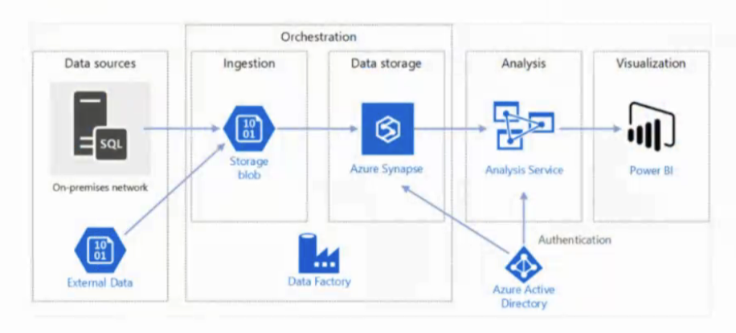
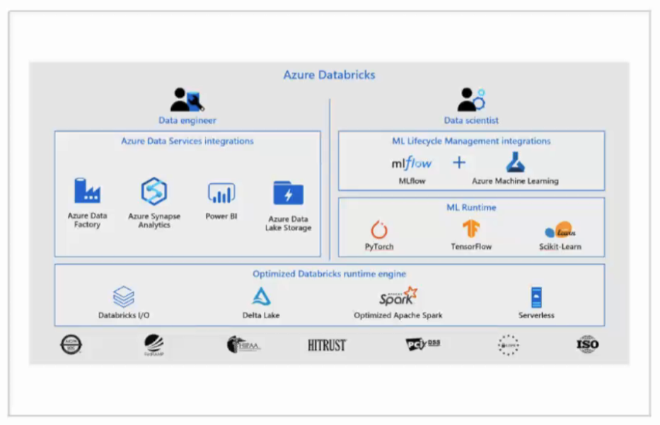
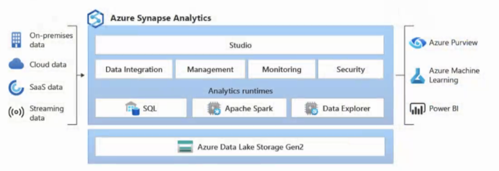
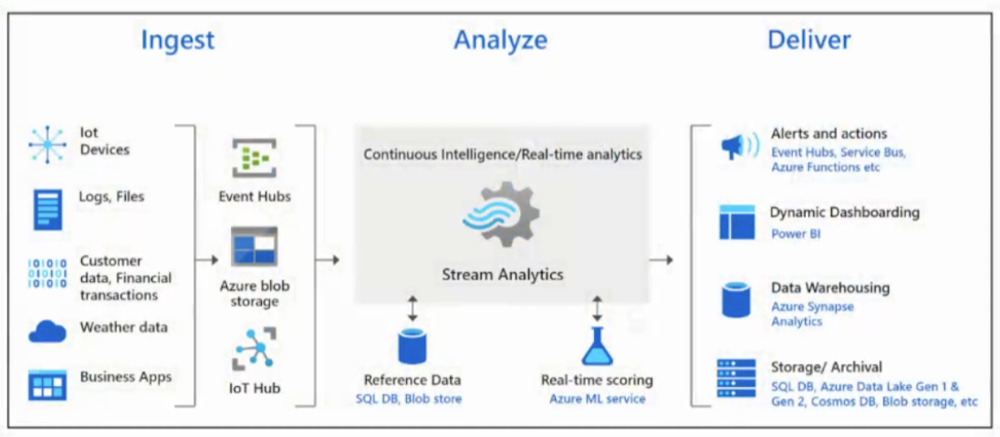
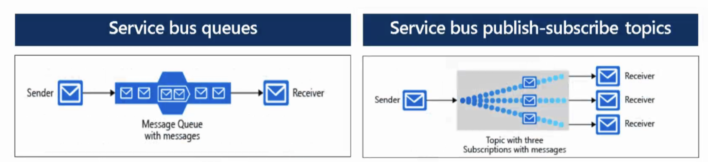
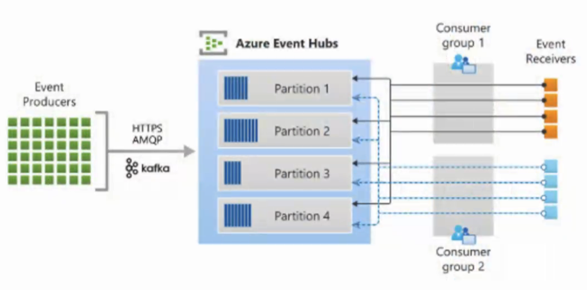
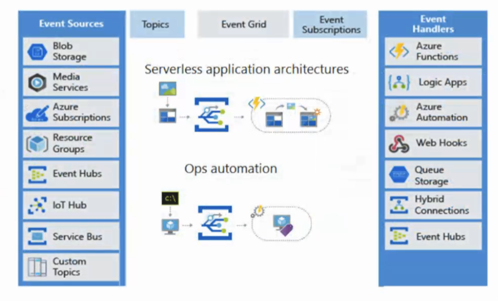
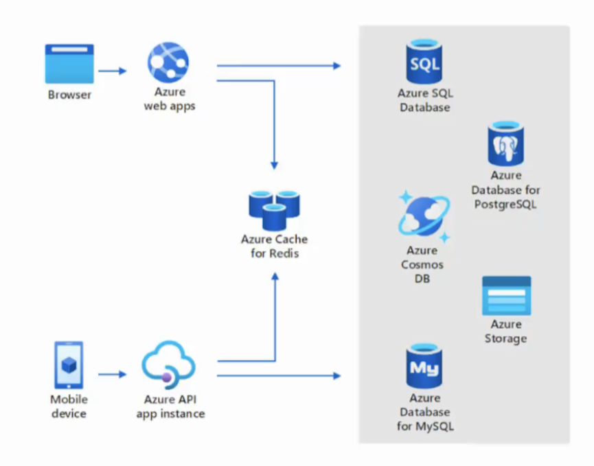
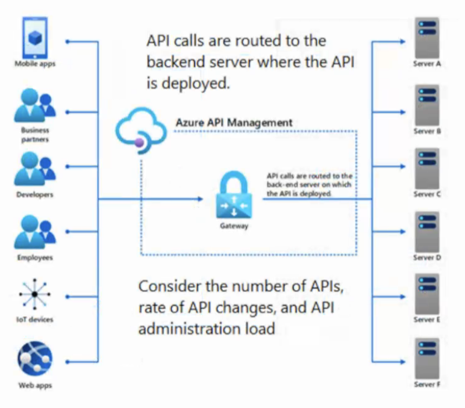

# Resumo

## Azure Data Factory

O Azure Data Factory é um serviço de integração de dados e ETL baseado em nuvem que permite criar e agendar fluxos de trabalho orientados por dados (chamados de pipelines) para ingerir dados de diferentes fontes de armazenamento.

Tem mais de 40 conectores nativos para serviços de nuvem e locais.

## Azure Databricks

é um serviço baseado no Apache Spark que fornece uma plataforma de análise unificada para ciência de dados e engenharia de dados.

## Azure Synapse Analytics

O Azure Synapse Analytics é um serviço de análise integrado que combina big data e data warehousing. 

Ele é a evolukção do Azure SQL Data Warehouse

## Azure Stream Analytics

O Azure Stream Analytics é um mecanismo de análise em tempo real e processamento de eventos complexos projetado para analisar e processar grandes volumes de dados em fluxo contínuo provenientes de várias fontes simultaneamente.

Análise em tempo real de dados de streaming, como eventos de IoT, logs de aplicativos e feeds de redes sociais.

# Events driven architecture

- Publish/Subscribe

- Event / Message

Service bus queues e topics

## Event Hubs

Azure event Hubs é um serviço de ingestão de eventos em tempo real que pode processar milhões de eventos por segundo. É ideal para cenários de big data e IoT, onde grandes volumes de dados precisam ser ingeridos e processados rapidamente.

Tópicos também de desenhar soluções de event-driven architecture

Azure Event Grid é um serviço de roteamento de eventos que permite criar soluções orientadas a eventos, onde os eventos são gerados e consumidos por diferentes serviços e aplicativos.

# Azure Cache for Redis

O Azure Cache for Redis é um serviço de cache em memória baseado no Redis, que é um banco de dados NoSQL em memória amplamente utilizado. 

Cenários principais - cache de dados, cache de conteúdo, armazenamento de sessão, enfileiramento de trabalhos e mensagens, e transações distribuídas

• Solução totalmente gerenciada

• Alta disponibilidade - responde automaticamente a mudanças previstas e imprevistas na demanda

• Mesmos benefícios de desempenho e escalabilidade em todo o mundo - isolamento de rede, criptografia de dados em trânsito

# Azure API Management

O Azure API Management é um serviço que permite criar, publicar, proteger e monitorar APIs de forma escalável e segura. 

Ele fornece uma camada de abstração entre os consumidores de APIs e os serviços back-end, permitindo que você controle o acesso, a segurança e o desempenho das suas APIs.

# IaC - Infrastructure as Code

O modelo laC gera o mesmo ambiente toda vez que é aplicado

• Resolve o problema de deriva ambiental

• Permite que as equipes testem aplicações em ambientes semelhantes à produção desde cedo

• Sempre que possível, utiliza arquivos de definição declarativos