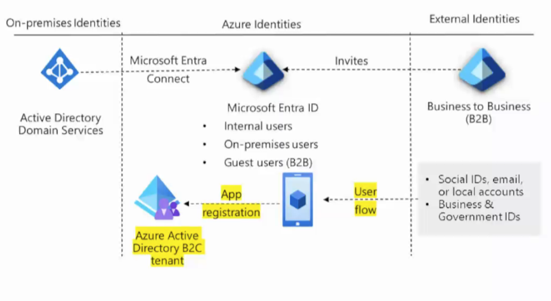

# Resumo

## Design Microsoft Entra ID

O Microsoft Entra ID segue a guideline Zero Trust, que nunca confia, mas sempre verifica.

# Design for condition access

- Use para habilitar a autenticação multifator

- Exija dispositivos gerenciados  

- Permita acesso apenas a aplicativos clientes aprovados  

- Exclua países dos quais você nunca espera um login  

- Responda a contas potencialmente comprometidas  

- Bloqueie completamente o acesso  

- Bloqueie protocolos de autenticação legados  

- Teste usando o modo somente relatório

## Identity protection

O Microsoft Entra ID Identity Protection é um serviço que ajuda a proteger identidades e dados em nuvem, detectando e respondendo a ameaças em tempo real.

• Configure as políticas e revise ativamente os resultados

• Defina a política de risco de entrada como Média e acima e permita opções de autorremediação

• Defina o limite da política de risco do usuário como Alto

• Permita a exclusão de usuários - contas de acesso de emergência ou administrador break-glass

• Envie dados para o Acesso Condicional ou outra ferramenta de gerenciamento de informações e eventos de segurança (SIEM)

### Notes

# Azure key vault

O Azure Key Vault é um serviço de gerenciamento de chaves e segredos que permite armazenar e acessar informações confidenciais, como chaves de criptografia, senhas e certificados.

## Perguntas importantes para esses temas

### Design Microsoft Entra ID e Acesso Condicional

- Quais são os principais riscos de segurança para identidades na sua organização?
- Quais usuários ou grupos precisam de acesso privilegiado?
- Existem aplicativos que exigem políticas de acesso diferenciadas?
- Como você identifica e responde a tentativas de acesso suspeitas?
- Quais países ou regiões devem ser bloqueados para acesso?
- Como garantir que apenas dispositivos gerenciados acessem recursos críticos?
- Como testar e validar as políticas de acesso condicional antes de aplicá-las em produção?

### Identity Protection

- Como você monitora e responde a alertas de risco de identidade?
- Quais critérios definem um usuário ou login de alto risco?
- Como lidar com contas de emergência (break-glass)?
- Como garantir que as políticas de risco não bloqueiem usuários legítimos?
- Como integrar o Identity Protection com ferramentas de SIEM?

### Azure Key Vault

- Quais tipos de segredos e chaves precisam ser protegidos?
- Quem deve ter acesso ao Key Vault e como esse acesso é controlado?
- Como auditar o acesso e o uso de segredos no Key Vault?
- Como automatizar a rotação de chaves e segredos?
- Como integrar o Key Vault com outros serviços do Azure para proteger dados sensíveis?

# Azure Monitor

## Camadas de dados e exemplos

### Application data

Sem agente especificado

Exemplo: Azure Monitor Metrics, Event Hubs, Azure Storage

### Operating System data

Diagnostic extension → Azure Monitor Metrics, Event Hubs, Azure Storage

Log Analytics agent → Log Analytics workspace

Dependency agent → VM Insights

### Azure resources data

Sem agente especificado

### Azure subscription data

Sem agente especificado

### Azure tenant data

Microsoft Entra ID → Azure Monitor logs, Azure Storage (arquivamento), Event Hubs

Os dados vão desde aplicações (nível mais alto) até componentes da plataforma Azure (nível mais baixo).

O método de acesso varia (ex: precisa instalar agentes).

Cada camada pode enviar dados para diferentes sistemas externos.

É importante priorizar quais fontes de dados são realmente necessárias.

# Azure Data Explorer

Logs de web

Aplicações ML, IoT, Big Data

https://learn.microsoft.com/en-us/training/modules/manage-secrets-with-azure-key-vault/?WT.mc_id=ilt_partner_webpage_wwl

https://learn.microsoft.com/en-us/training/modules/secure-azure-resources-with-rbac/?WT.mc_id=ilt_partner_webpage_wwl

https://learn.microsoft.com/en-us/training/modules/end-to-end-encryption-with-app-gateway/?WT.mc_id=ilt_partner_webpage_wwl