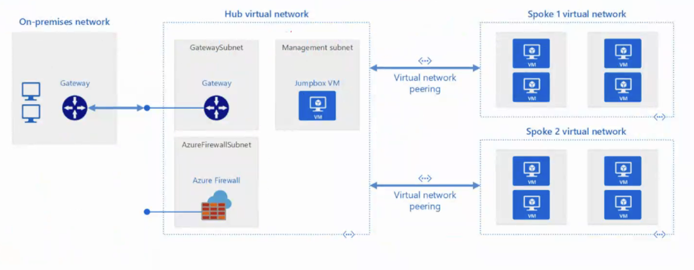
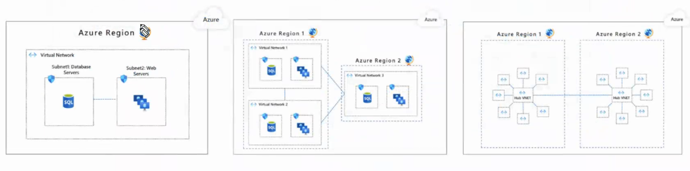
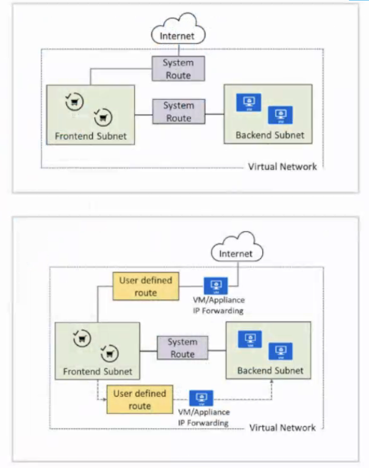
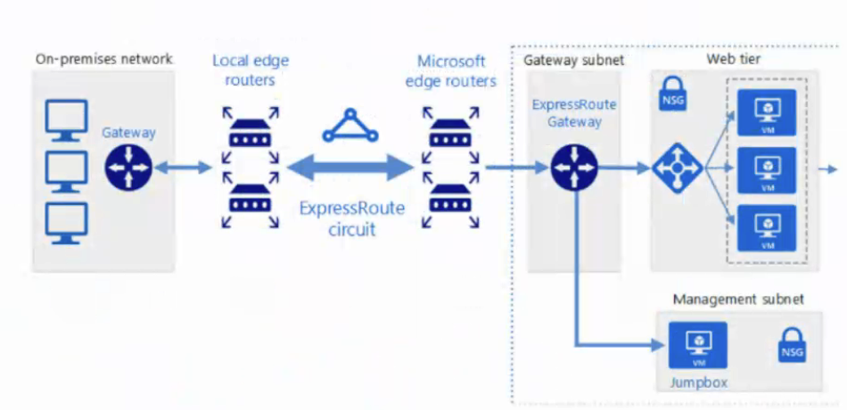
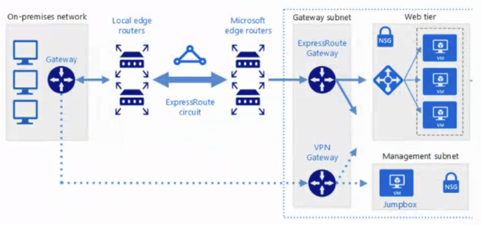
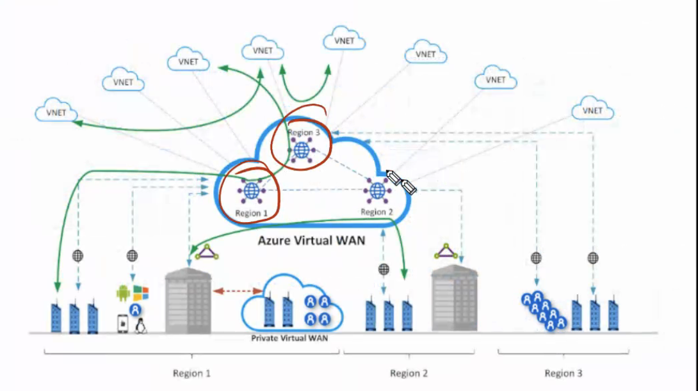
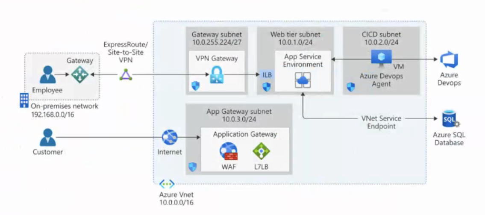
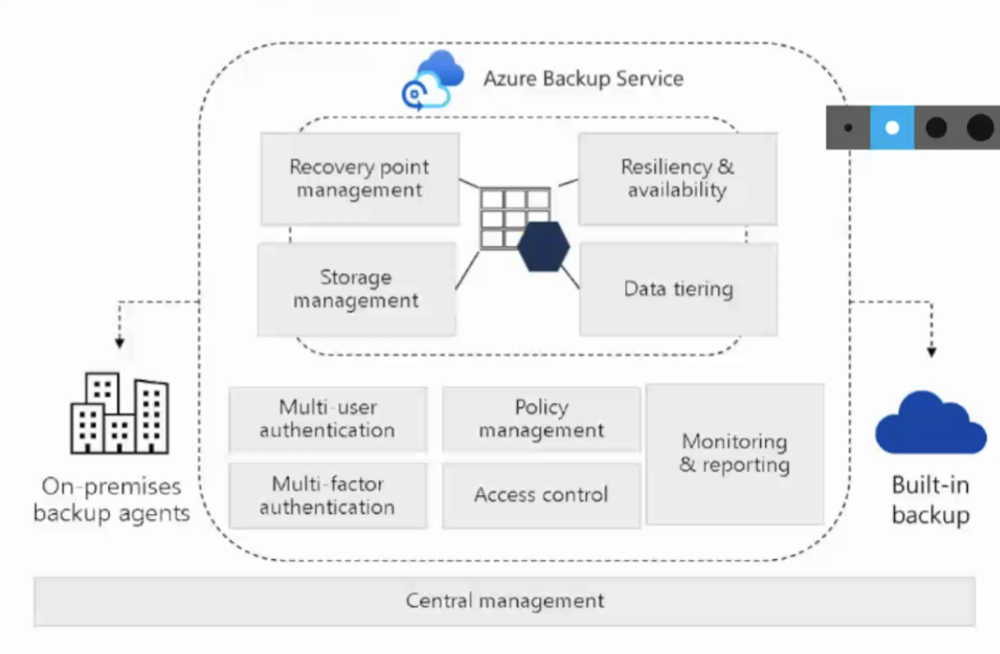

# Resumo

## Layers

Compute
Perimeter
Identity & Access
Application
Data
Physical Security
Network

## Design Azure Virtual Networks




Padrão 1: Rede Virtual Única

Padrão 2: Múltiplas Redes Virtuais com emparelhamento entre elas

Padrão 3: Múltiplas Redes Virtuais em um modelo hub & spoke



# Design Routing

## User Defined Routes (UDR)

## BGP routes

https://learn.microsoft.com/en-us/azure/vpn-gateway/vpn-gateway-bgp-overview

## System Routes



## ExpressRoute





## Azure Wan



# Load balancer solution

Load balancing services to distribute your workloads across multiple computing resources - Azure Front Door, Traffic Manager, Load Balancer, and Application Gateway.

## Application gateway


 
# Azure Front Door

É um serviço global de balanceamento de carga e aceleração de aplicativos que fornece alta disponibilidade e desempenho para aplicativos em várias regiões.

```bash
➜  ~ curl -o /dev/null -s -w "DNS: %{time_namelookup}s\nConexão: %{time_connect}s\nInício da resposta: %{time_starttransfer}s\nTotal: %{time_total}s\n" https://aa-planning.dev/api/feed
DNS: 0.002727s
Conexão: 0.012715s
Início da resposta: 0.227059s
Total: 0.227854s
```

# Design de Backup e Recuperação no Azure

• Projetar para backup e recuperação

• Projetar para Azure Backup

• Projetar para backup e recuperação do Azure Blob

• Projetar para backup e recuperação do Azure Files

• Projetar para backup e recuperação de máquinas virtuais Azure

• Projetar para backup e recuperação do Azure SQL

• Projetar para Azure Site Recovery

Identificar os requisitos de recuperação de desastres e continuidade de negócios para os serviços do Azure.

# Planejamento de recuperação de desastres

• Quais são suas cargas de trabalho e seus usos?  
• Quais são os padrões de uso das suas cargas de trabalho?  
• Quais são as métricas de disponibilidade (MTTR e MTBF)?  
• Quais são as métricas de recuperação (RTO e RPO)?  
• Quais são as metas de disponibilidade das cargas de trabalho?  
• Quais são seus SLAs?

## MTTR (Mean Time To Repair)

O tempo médio necessário para reparar um sistema após uma falha. É uma métrica importante para avaliar a eficiência das operações de TI e a capacidade de resposta a incidentes.

# MTBF (Mean Time Between Failures)

O tempo médio entre falhas. É uma métrica que mede a confiabilidade de um sistema, indicando quanto tempo ele opera sem falhas.

## RTO (Recovery Time Objective)

O tempo máximo aceitável para restaurar um sistema ou serviço após uma interrupção. É uma métrica crítica para planejar a continuidade dos negócios e garantir que os serviços sejam restaurados rapidamente.

## RPO (Recovery Point Objective)

O ponto máximo aceitável de perda de dados em caso de falha. É uma métrica que ajuda a determinar a frequência dos backups e a estratégia de recuperação de dados.

## SLA (Service Level Agreement)

Um acordo formal entre um provedor de serviços e um cliente que define os níveis de serviço esperados, incluindo disponibilidade, desempenho e suporte. Os SLAs são essenciais para garantir que as expectativas sejam atendidas e que haja responsabilidade em caso de falhas.

# RLO (Recovery Level Objective)

O nível de recuperação desejado para um sistema ou serviço. Isso pode incluir requisitos específicos, como a quantidade de dados que podem ser perdidos (RPO) e o tempo necessário para restaurar o serviço (RTO). O RLO ajuda a definir as expectativas de recuperação e a orientar as estratégias de backup e recuperação.

# Quando usar Azure Backup



Escalabilidade ilimitada com alta disponibilidade e transferência de dados ilimitada  

• Replicação automática de armazenamento localmente redundante e armazenamento georredundante usando um modelo de pagamento conforme o uso 

• Backups consistentes com a aplicação, com transmissão e armazenamento seguros dos seus dados no Azure  

• Sem limites para o tempo de retenção dos dados de backup

