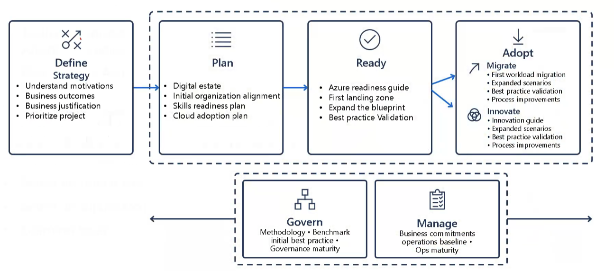

# Resumo

## Design a migration solution

## Definir estratégia de migração

- Verificar o projeto urgente para a migração ( podemos migrar os mais fáceis primeiro )

- Verificar o projeto mais importates 

- Entender motivações e objetivos

## Planear a migração

- Devemos ter regras de segurança

- Devemos ter regras de conformidade

- Devemos ter regras de governança

- Boas práticas de migração

- Devemos ter um plano de migração

Tivemos um papo aqui de Pronto para migrar, adoção e governança. ( muita coisa pra escrever kk )

## Estratégia de migração

- Rehospedar: Mova cargas de trabalho rapidamente para a nuvem.
    • Não é necessário fazer alterações imediatas nas capacidades do aplicativo.

- Refatorar: Aplique práticas do Azure DevOps ou utilize uma estratégia de contêiner para cargas de trabalho.
    • Considere a portabilidade da sua base de código existente e as habilidades de desenvolvimento disponíveis.

- Rearquitetar: Use investimentos existentes em aplicativos.
    • Os aplicativos precisam de grandes revisões para novos recursos e para funcionar de forma eficaz na nuvem.

- Reconstruir: Desenvolvimento rápido e aplicativos existentes com funcionalidade e vida útil limitadas.
    Acelere a inovação nos negócios usando práticas do Azure DevOps.
    • Aplicativos legados como aplicativos sem código ou de baixo código na nuvem.

## Determine o que migrar

- Cargas de trabalho do Windows Server
    • Máquinas virtuais Windows locais (exceto bancos de dados)

- Cargas de trabalho do SQL Server
    • Bancos de dados e outras funcionalidades executando em máquinas virtuais SQL Server

- Cargas de trabalho Linux
    • VMs RedHat ou SUSE, além de Hadoop e containers Linux

- Apps ASP.NET-PHP-Java
    • Aplicativos voltados para o cliente e internos em nível SaaS

- SAP HANA
    • Planejamento de recursos empresariais com banco de dados centralizado

- Computação especializada
    • Computação de alto desempenho (HPC)

# Ferramentas de migração

| Serviço Azure Migrate                  | Função Principal                                                                                      |
|---------------------------------------|--------------------------------------------------------------------------------------------------------|
| **Server Assessment**                 | Avalia servidores físicos e VMs locais (Hyper-V/VMware) para migração para o Azure.                   |
| **Server Migration**                  | Migra servidores físicos e VMs (locais ou de outras nuvens) para o Azure.                             |
| **Database Assessment**               | Avalia bancos SQL Server locais para migração ao Azure SQL (Database, Managed Instance ou VM).        |
| **Database Migration**                | Migra dados de bancos locais para bancos de dados no Azure.                                           |
| **Web App Assessment**                | Avalia aplicações web locais e as migra para o Azure.                                                  |
| **Data Box**                          | Transfere grandes volumes de dados offline para o Azure com o Azure Data Box.                         |

