# AZ-700: Designing and Implementing Microsoft Azure Networking Solutions

Load balancer é um mecanismo que distribui o tráfego de rede entre várias instâncias de um serviço ou aplicativo.

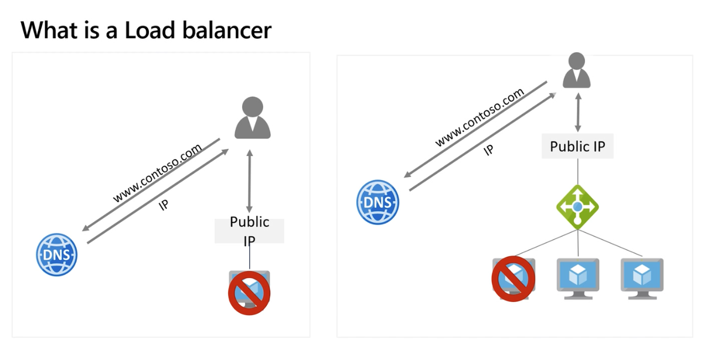

Serve para TCP / UDP

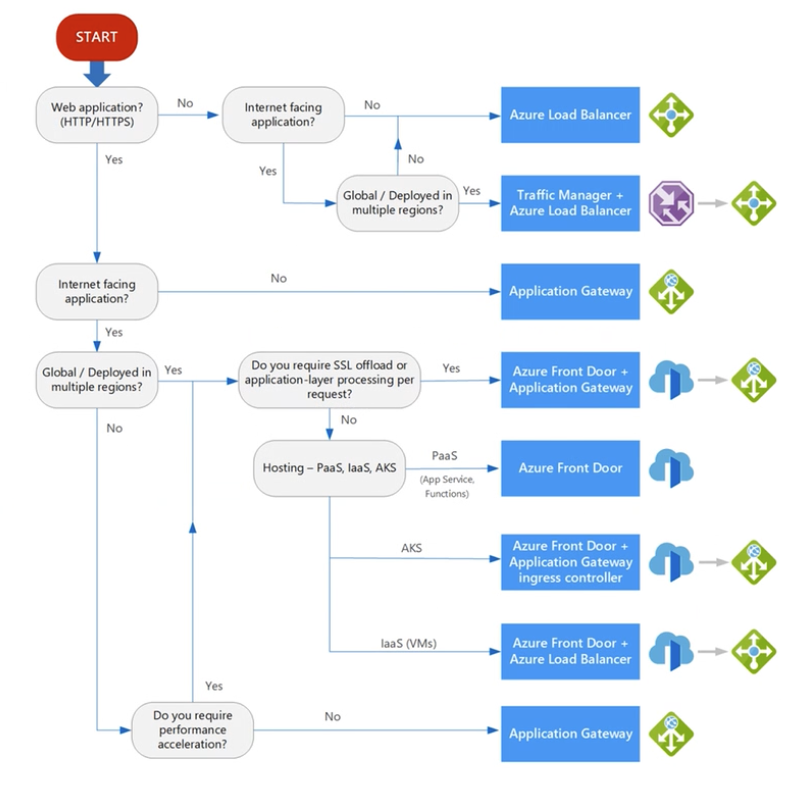

Sempre que tem um IP público, vai ter um load balancer

Choosing a Load Balancer type

• Gateway Load Balancer
• Azure Load balancer and availability zones
• Determine Load Balancer SKUs
• Create Load balancer in the

Azure portal

• Create Backend Pools
• Create Load Balancer Rules
• Configure Session Persistence
• Create Health Probes
• Demonstration
• Exercise - Create and configure a load balancer
• Learning Recap

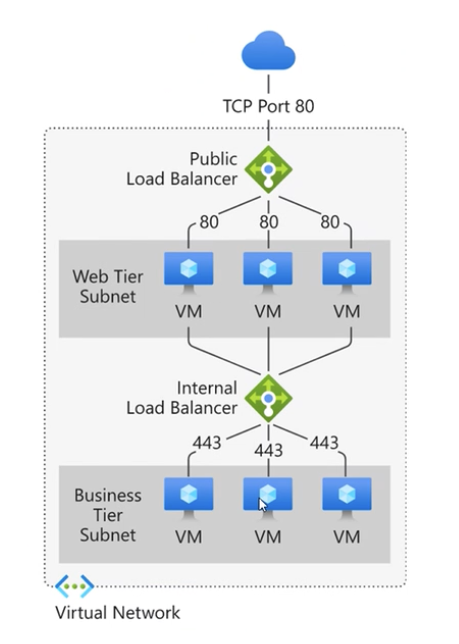

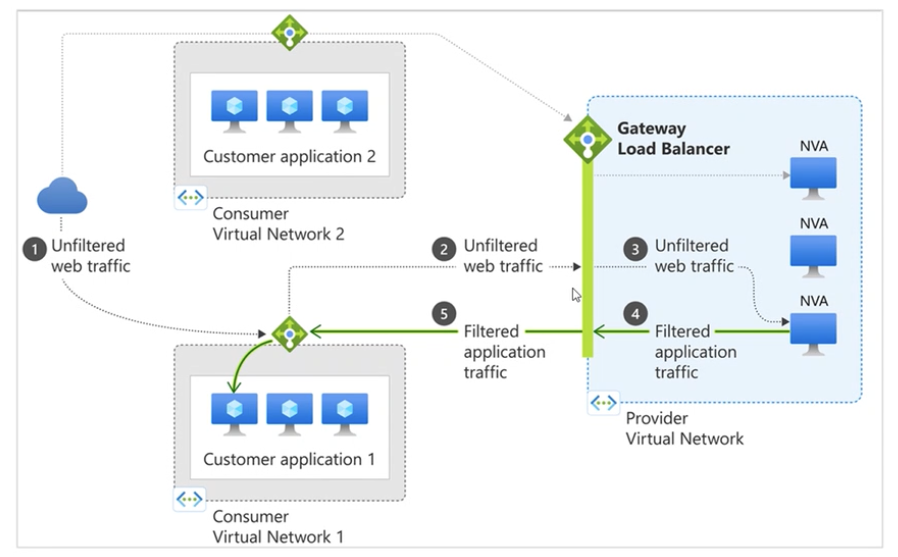

Gateway Load Balancer é sempre interno ( private frontend )

Podemos ter várias NVAs em uma VNet

Estando mesmo em uma região, a latência é quase nula

O que é um NVA?

NVA é um appliance virtual que pode ser um firewall, um proxy, um IDS/IPS, etc

https://learn.microsoft.com/en-us/azure/architecture/networking/guide/network-virtual-appliance-high-availability

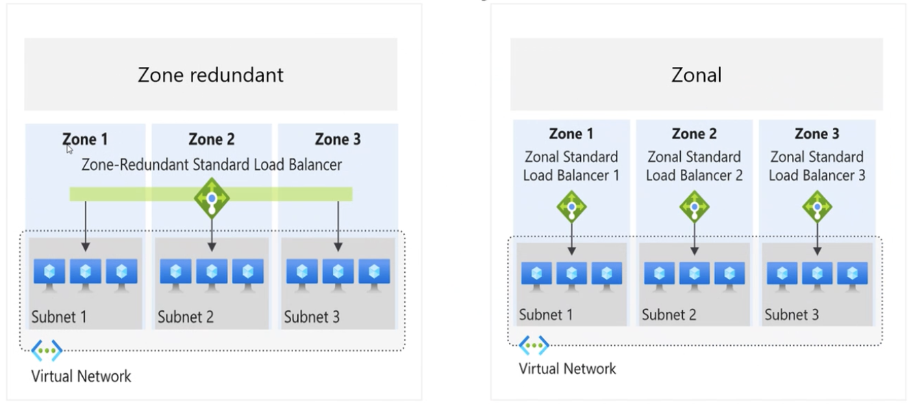

Standard SKU é o que tem mais recursos

SLA 99,99% para o Standard SKU

O que é NSG?

https://learn.microsoft.com/en-us/azure/virtual-network/network-security-groups-overview

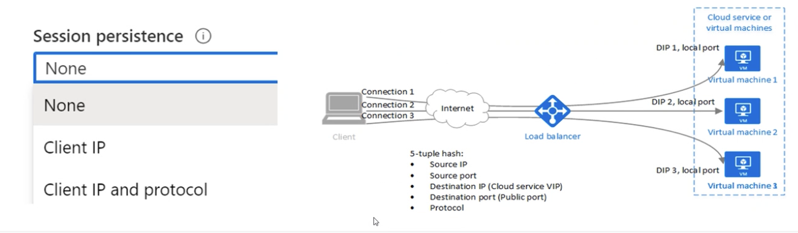

A Session Persistence é o que garante que o tráfego de um cliente vai sempre para a mesma instância do serviço

-----------

Traffic manager 

Traffic pode apontar pra outro traffic manager

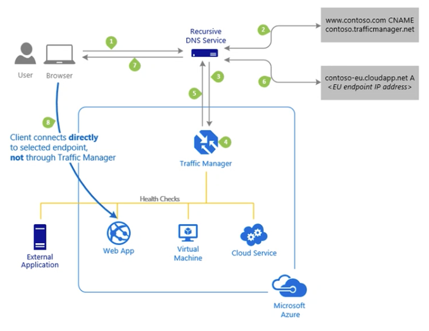

Aplicações como Teams e XBox funcionam com o Traffic Manager

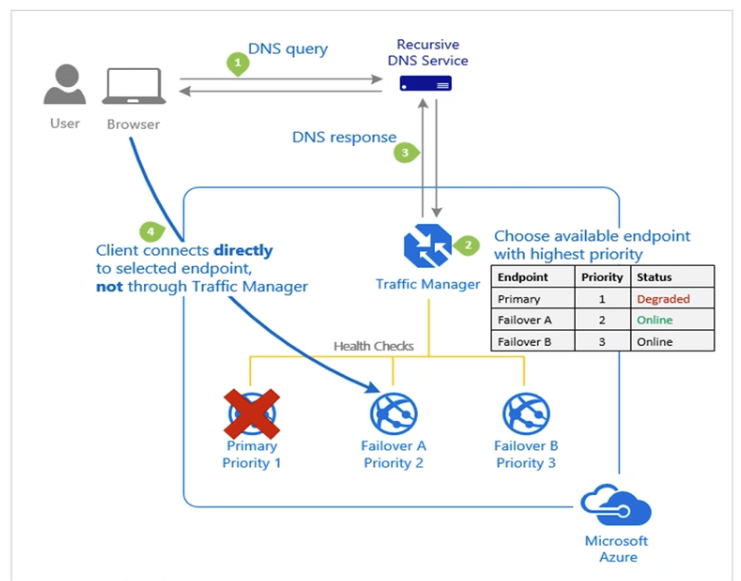

O mais básico é o Priority

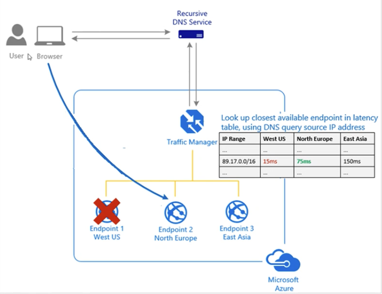

o calculo da latência é entre o DNS e o endpoint que ta mais perto do cliente.

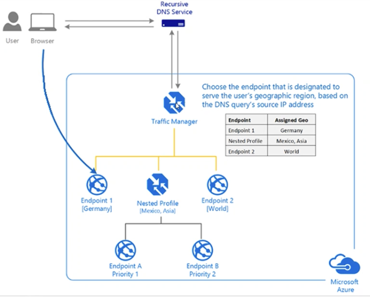

Traffic manager endpoints
on prem, outras clouds, etc

### Application Gateway

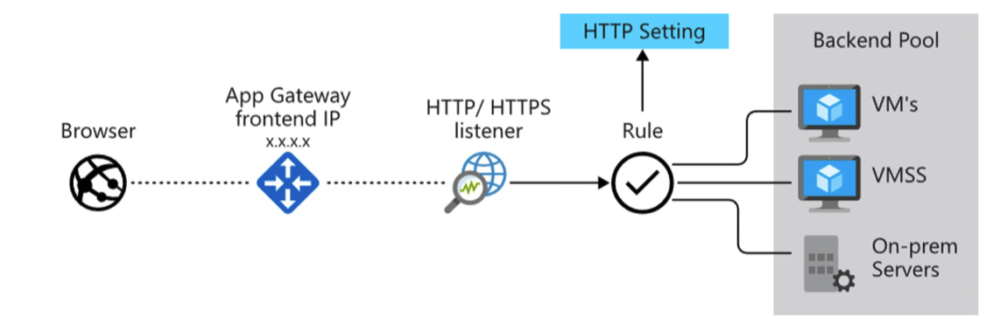

Application gateway routing pode ser path based ou multiple site

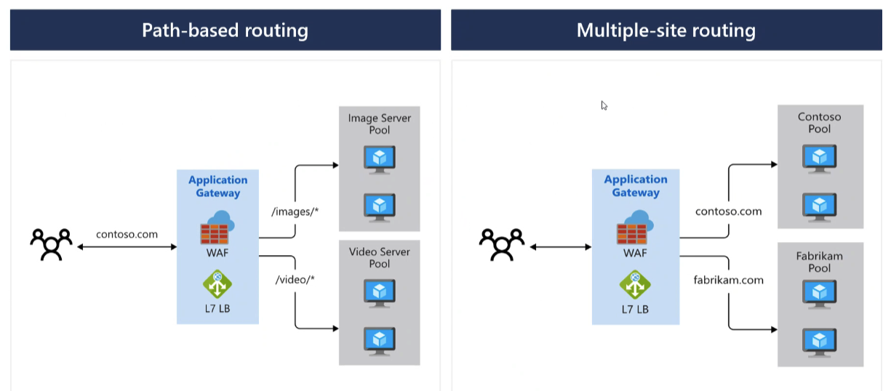

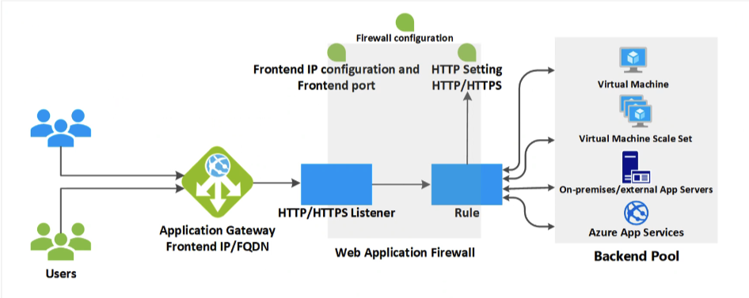

https://statics.teams.cdn.office.net/evergreen-assets/safelinks/1/atp-safelinks.html

### Design and Configure Azure Front Door

What is Azure Front Door
• Azure Front Door Standard and Premium
• Create a Front Door in the Azure portal
• Configure routing and redirection rules
• Configure an origin (Backend)
• Configure health probes
• Secure Front Door with SSL and end-to-end

SSL encryption
• Demo
• Learning Recap

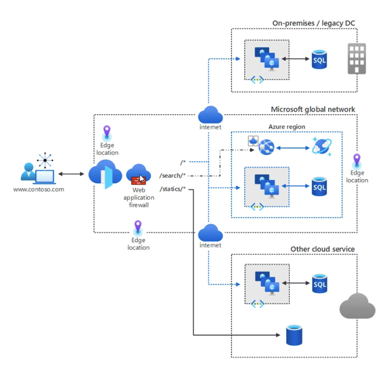

SSL offload

O caminho entre a gateway e o backend é na VNET, então não é necessário fazer o SSL offload.

