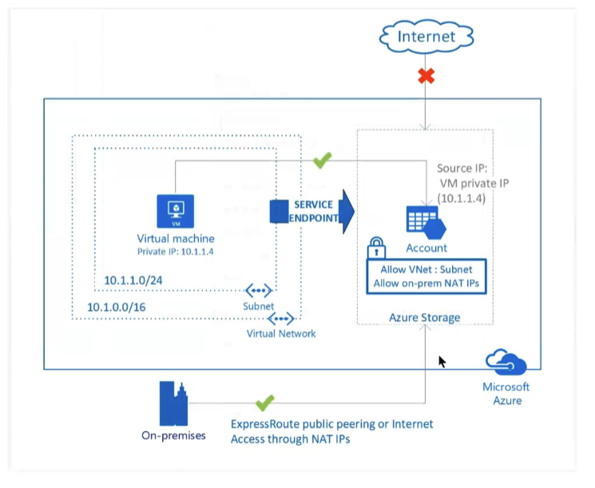

# Resumo

Última aula AZ 700

## Acesso aos Labs

https://github.com/MicrosoftLearning/AZ-700-Designing-and-Implementing-Microsoft-Azure-Networking-Solutions

# Private endpoint

Um endpoint privado é uma interface de rede que utiliza um endereço IP privado da sua rede virtual. Essa interface de rede conecta você de forma privada e segura a um serviço que é alimentado pelo Azure Private Link. Ao habilitar um endpoint privado, você está trazendo o serviço para dentro da sua rede virtual.

Ele vai criar uma placa de rede e vai conectar diretamente

O objetivo é segurança

https://learn.microsoft.com/en-us/azure/private-link/private-endpoint-overview

