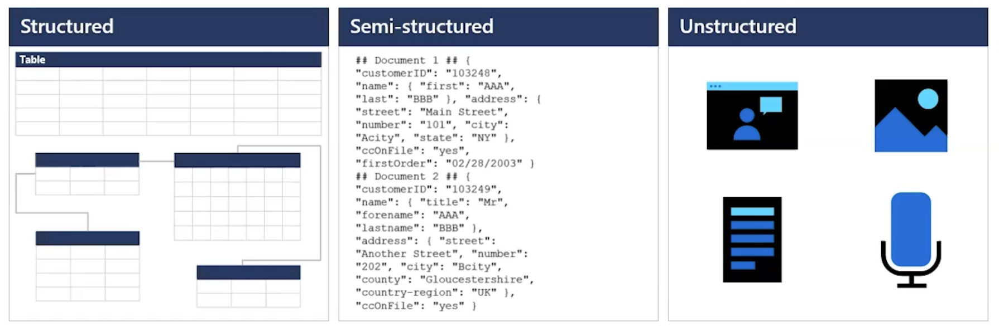
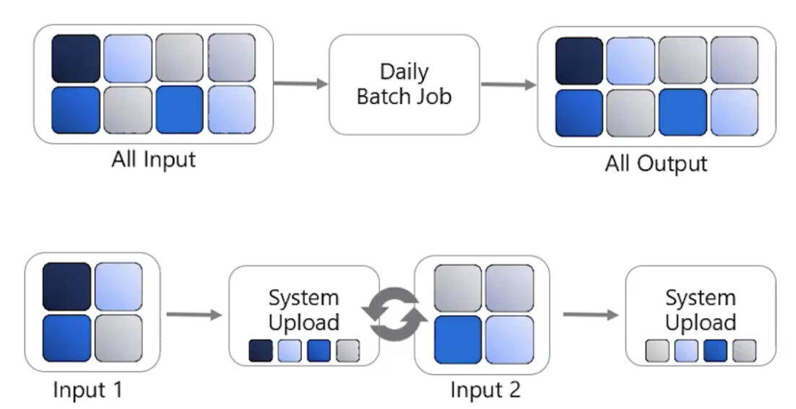
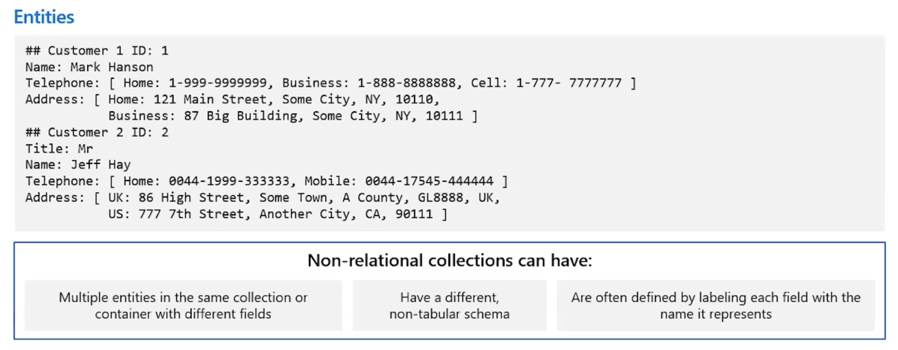
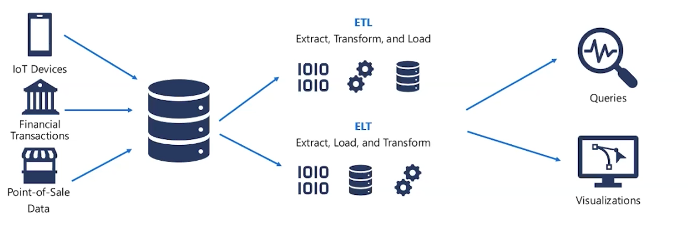

# DP-900 Azure Data Fundamentals

- Dados estruturados ( SQL, Relacional, Tabelas )

- Dados semi estruturados ( JSON, XML, CSV )

- Dados não estruturados ( Audio, Vídeo, Imagem )

# 01 - processamento transacional e analítico

Online Transaction Processing (OLTP) e Online Analytical Processing (OLAP)

- OLTP: Processamento de transações em tempo real, geralmente com dados estruturados. Exemplo: sistemas bancários, e-commerce.

Aqui pode ser um select, um insert, um update ou delete na nossa base de dados.

- OLAP: Processamento analítico de grandes volumes de dados, geralmente com dados não estruturados ou semi-estruturados. Exemplo: data warehouses, análise de big data.

Processamento analítico, a partir de um conjunto de dados, você vai fazer uma análise, um relatório, uma consulta mais complexa.

Pode ser venda ao longo do ano, pode ser o desempenho de um produto pelo preço ou pela região, etc.

E fica em um ambiente multi dimensional, chamado de cubo de dados.

- **Diferenças**:
  - OLTP: foco em transações rápidas e frequentes, com dados atualizados em tempo real.
  - OLAP: foco em consultas complexas e análises de grandes volumes de dados, com dados geralmente históricos.

# ACID - Atomicidade, Consistência, Isolamento e Durabilidade

## Atomicidade

Cada transação é única, pode ter uma ou mais operações, e deve ser tratada como uma unidade atômica. 

## Consistência

Garante que os dados estejam sempre em um estado válido antes e depois da transação. 

## Isolamento

Garante que as transações sejam executadas de forma isolada, sem interferência de outras transações.

## Durabilidade

Uma vez que uma transação é confirmada, os dados são gravados de forma permanente, mesmo em caso de falha do sistema.

# Workload Analítico

Nossa informação esta previamente estruturada, e vamos fazer uma análise sobre ela.

Ajudam para tomar decisões de negócios, identificar tendências e padrões, e otimizar processos.

## Processamento de dados

Batch: Processamento em lote, onde os dados são coletados e processados em intervalos regulares. Exemplo: ETL (Extract, Transform, Load).

Stream: Cada novo pedaço de informação é processado em tempo real, permitindo análises imediatas. Exemplo: Apache Kafka, Azure Stream Analytics.

# 02 - Responsabilidades no mundo dos dados

### Administrador de Banco de Dados (DBA)
- Gerenciamento de Banco de Dados
- Implementa Segurança de Dados
- Backups
- Acesso de Usuários
- Monitora desempenho

# Engenheiro de Dados
- Pipelines e processos de dados
- Ingestão e armazenamento de dados
- Prepara dados para análise
- Prepara dados para processamento analítico

# Analista de Dados
- Fornece insights sobre os dados
- Relatórios visuais
- Modelagem de dados para análise
- Combina dados para visualização e análise

## Ferramentas para administração de dados

### Azure Data Studio

- Interface gráfica para gerenciamento de serviços de dados locais e na nuvem

- Compatível com Windows, macOS e Linux

### SQL Server Management Studio (SSMS)

Interface gráfica para gerenciamento de serviços de dados locais e na nuvem

Compatível com Windows

Ferramenta abrangente de administração de bancos de dados

# Azure Portal / CLI

Ferramentas para gerenciamento e provisionamento de Serviços de Dados do Azure

Execução manual e automação de scripts usando Azure Resource Manager ou scripts via linha de comando (CLI)

## Ferramentas para engenharia de dados

## Azure Synapse Studio

Portal do Azure integrado para gerir o Azure Synapse

Ingestão de dados (Azure Data Factory)

Gestão de ativos do Azure Synapse (SQL Pools / Spark Pool)

## SQL Server Management Studio

Interface gráfica para gerir serviços de dados locais e na cloud

Funciona no Windows

Ferramenta abrangente de administração de bases de dados

## Azure Portal / CLI

- Ferramentas para gestão e provisionamento de recursos do Azure

- Execução manual e automatizada de scripts utilizando o Azure Resource Manager ou a interface de linha de comandos (CLI)

## Ferramentas para análise de dados

## Power BI Desktop

- Ferramenta de visualização de dados

- Modelação e visualização de dados

- Gestão de ativos do Azure Synapse (SQL Pools / Spark Pool)

## Power BI Portal / Power BI Service

- Criação e gestão de relatórios Power BI

- Criação de dashboards no Power BI

- Partilha de relatórios e conjuntos de dados

## Power BI Report Builder

- Ferramenta de visualização de dados para relatórios paginados

- Modelação e visualização de relatórios paginados

# 03 Conceitos de dados relacionais

Casos de uso para dados relacionais:

- IOT
Armazenamento e análise de dados de dispositivos conectados, como sensores e dispositivos móveis.

- Transações Online
Permite executarmos operações de forma transacional, garantindo a integridade dos dados.

- Data Warehousing
Armazenamento de grandes volumes de dados de fontes diversas para análise e relatórios.

# Normalização de dados

- Reduzir espaço em storage (ao evitar redundância)

# Outros assuntos

( Aqui na aula falou de indices, views virtuais e materializada, mas fiquei com preguiça de anotar.... )

# 04 - Conceitos de dados não relacionais

Dados pode partilhar estrutura, mas não tem uma estrutura rígida como os dados relacionais.

Como podemos identificar casos de uso?

# IOT e Telefonia

Processamento de grandes volumes de dados de dispositivos conectados, como sensores e dispositivos móveis, que necessitam de processamento em tempo real e flexibilidade na estrutura dos dados.

# Retalho e E-commerce
cenários que dados estão distribuidos globalmente, com alta disponibilidade e escalabilidade, como em aplicações de retalho e e-commerce.

# Jogos

Aplicações de baixa latência e alta disponibilidade, como jogos online, que exigem flexibilidade na estrutura dos dados e capacidade de escalar rapidamente. Stats, score, leaderboard, etc.

# Web e Mobile

Logs, análise de clicks, navegação, etc.

Quais são os tipos de dados não estruturados?

- JSON
- AVRO
- ORC
- Parquet
- XML

Não precisa ser exatamente o mesmo formato, mas deve ser possível converter entre eles.

Vídeo, áudio, imagem, etc. são considerados dados não estruturados.

Frequentemente usado em combinação com capacidades de Machine Learning ou Serviços Cognitivos para "extrair dados" utilizando:

- Análise de Texto
- Análise de Sentimento com APIs Cognitivas
- API de Visão

O que é NoSQL? 

- Key-Value stores
Um dicionário, onde cada chave é única e mapeada para um valor. Exemplo: Redis, DynamoDB.

- Document based
Um banco de dados que armazena dados em documentos
Cada estrutura é um documento, e cada documento pode ter uma estrutura diferente.

- Column-family database
Um banco de dados que armazena dados em colunas, permitindo consultas eficientes em grandes volumes de dados.

- Graph database
Um banco de dados que armazena dados em grafos, permitindo consultas eficientes em relacionamentos complexos.

# 05 - Conceitos de análise de dados

## Jornada de dados

- Data Ingestion

Coleta de dados de diversas fontes, IoT, Transações, pontos de venda, etc.

- Data Processing

ETl (Extract, Transform, Load) para preparar os dados para análise.

ELT (Extract, Load, Transform) para carregar os dados em um data warehouse.

- Data Visualization

Criação de dashboards e relatórios para visualizar os dados e insights.

Queries e relatórios para análise de dados.

Explorando análise de dados

- Análise Descritiva
  - Resumo dos dados, estatísticas descritivas, visualizações básicas.
  - Exemplo: média, mediana, moda, desvio padrão.
- Análise Diagnóstica
  - Identificação de padrões e correlações nos dados.
  - Exemplo: análise de tendências, correlação entre variáveis.
- Análise Preditiva
  - Uso de modelos estatísticos e algoritmos de machine learning para prever resultados futuros.
  - Exemplo: previsão de vendas, churn de clientes.
- Análise Prescritiva
  - Recomendações baseadas em análises preditivas e simulações.
  - Exemplo: otimização de campanhas de marketing, alocação de recursos.
- Análise Cognitiva
  - Uso de inteligência artificial para entender e interpretar dados complexos.
  - Exemplo: análise de sentimentos, reconhecimento de padrões em grandes volumes de dados.

