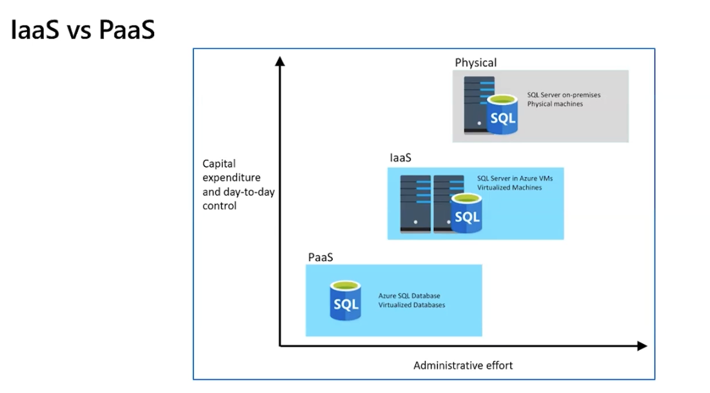
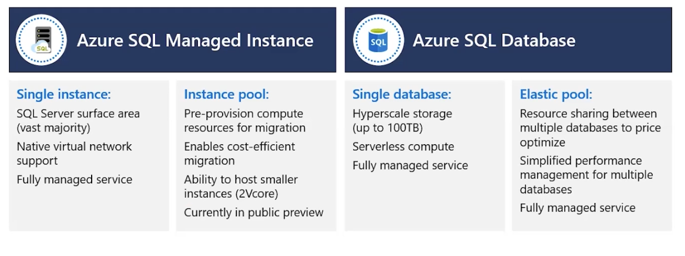
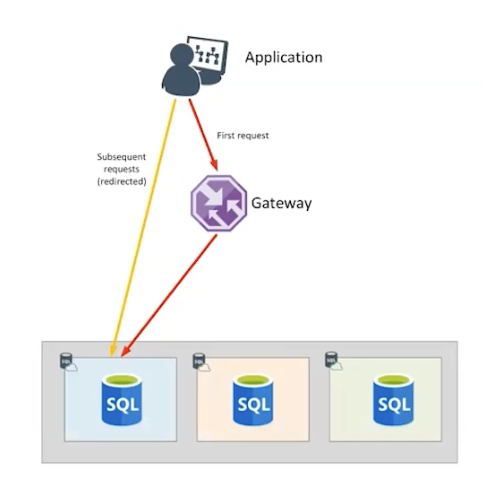
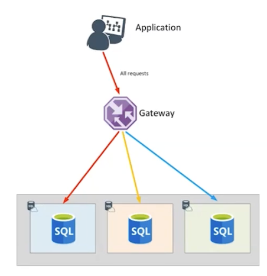

# DP-900 Azure Data Fundamentals

# Serviços de Dados Relacionais no Azure - 689216904

O que são Azure data services?

Sistemas de gestão de base de dados, que são geridos pelo Azure.

A Manutenção é feita pelo Azure, e não pelo cliente.

Podemos trabalhar com Azure SQL Server, MariaDB, PostgreSQL, MySQL, entre outros.

## SQL Server nas máquinas virtuais do Azure

Tudo fica na nossa responsabilidade. Desde upgrade, manutenção, etc.

Pagamos pelo uso de máquinas virtuais, licença do windows e SQL Server.

## Azure SQL Database

é uma PaaS, focamos somente na base de dados, o resto é gerido pelo Azure.

é possivel escalar a base de dados, com elastic pools, que permitem que várias bases de dados partilhem recursos.

## Azure SQL Managed Instance

Podemos ter uma instância única, ou um pool de instâncias.

é quase 100% compatível com o SQL Server on-premises.

## Azure Database

Podemos ter MariaDB, PostgreSQL e MySQL como serviços de banco de dados gerenciados.

- Banco de dados comunitário totalmente gerenciado:
Aproveite um serviço totalmente gerenciado enquanto utiliza as ferramentas e linguagens com as quais você já está familiarizado

- Alta disponibilidade integrada para menor TCO:
Garanta que seus dados estejam sempre disponíveis sem custos adicionais

- Desempenho e escala inteligentes:
Melhore o desempenho com inteligência integrada e até 16TB de armazenamento e 20K IOPs

- Segurança e conformidade líderes do setor:
Proteja seus dados com recursos de segurança avançados, incluindo Proteção Contra Ameaças Avançadas

- Integração com o ecossistema Azure:
Desenvolva aplicativos mais rapidamente com os serviços Azure e proteja sua inovação com o Azure IP Advantage

# Explore o provisionamento e a implantação de serviços de banco de dados relacional no Azure - 689219406

## Configuração dos data services

- Garantir subscrição do Azure ativa
- Criar um grupo de recursos
  - Um grupo de recursos é um container lógico que contém recursos relacionados para uma solução do Azure.
  - Os grupos de recursos facilitam o gerenciamento, a organização e a segurança dos recursos do Azure.
- Criar uma instância
- Conexão com a base de dados
- Configurar região
  - A região é a localização geográfica onde os recursos do Azure são implantados.
  - Escolher uma região próxima aos usuários finais para reduzir a latência e melhorar o desempenho.

## Conectividade com a base de dados

### Dentro do azure

podemos ligar a partir do portal ou via Gateway.

A Gateway pode conectar a outra base de dados caso uma delas falhe. ( passando para réplica )

Quando se cria uma base de dados, ela tem pelo menos 3 réplicas internas, para garantir alta disponibilidade e recuperação de desastres.

### Fora do azure

Podemos ligar a partir do gateway

A Diferença é que dentro do Azure, a conexão é feita diretamente com a base de dados, enquanto fora do Azure, a conexão é feita através de um gateway.

### Autenticação e Controle de acesso

- Mixed mode é a autenticação mista, que permite autenticação do SQL Server e do Azure.

- Podemos utilizar Azure AD

### Replicas de leitura

Podemos definir réplicas de leitura para melhorar o desempenho de consultas de leitura, permitindo que podemos ter uma replica para BI, outra para consultas de leitura, etc.

# Query relational data in Azure - 689220907

### Introdução ao SQL

- DML
  - Data Manipulation Language
  - Utilizada para manipular dados dentro de uma base de dados.
  - Exemplos: SELECT, INSERT, UPDATE, DELETE

- DDL
  - Data Definition Language
  - Utilizada para definir a estrutura de uma base de dados.
  - Exemplos: CREATE, ALTER, DROP

- DCL
  - Data Control Language
  - Utilizada para controlar o acesso aos dados.
  - Exemplos: GRANT, REVOKE

- TCL
  - Transaction Control Language
  - Utilizada para controlar transações dentro de uma base de dados.
  - Exemplos: COMMIT, ROLLBACK, SAVEPOINT

# Labs - 689728663