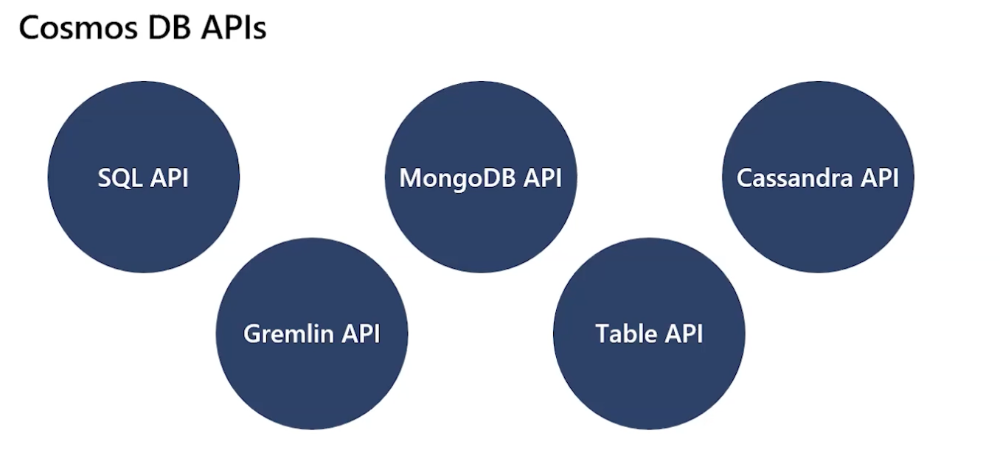

# Explorando base de dados não relacionais no Azure - 689225155
## Armazenamento de Tabelas do Azure

- Armazenamento de dados não relacionais baseado em tabelas.

## Armazenamento de Blobs do Azure

### Blobs de Bloco
- Tamanho máximo de 4,7 TB.
- Ideal para armazenar objetos binários grandes, discretos e que mudam com pouca frequência.
- Cada bloco individual pode armazenar até 100 MB de dados.
- Um blob de bloco pode conter até 50.000 blocos.

### Blobs de Página
- Podem armazenar até 8 TB de dados.
- Organizados como uma coleção de páginas de tamanho fixo de 512 bytes.
- Usados para implementar armazenamento de disco virtual para máquinas virtuais.

### Blobs de Anexação
- O tamanho máximo é de pouco mais de 195 GB.
- É um blob de bloco otimizado para operações de anexação.
- Cada bloco individual pode armazenar até 4 MB.

## Azure blob storage

Server message block protocol (SMB) é um protocolo de rede usado para compartilhar arquivos e impressoras em uma rede. 

O Azure Blob Storage oferece suporte ao SMB 3.0, permitindo que os clientes acessem blobs como se fossem arquivos em um sistema de arquivos.

## Azure Cosmos DB

- O Cosmos DB gerencia dados como um conjunto particionado de documentos.

- Acesso em tempo real com latências rápidas de leitura e gravação.

- Aproveita as capacidades de escalabilidade e armazenamento do Azure.

Use cases:

Web e retalho: podemos ter processos de leitura e escrita com menos de 10 milissegundos de latência.

Jogos: jogos online com milhões de jogadores, onde a latência é crítica.

IoT: dispositivos IoT que geram grandes volumes de dados, onde a latência é crítica.

- Suporta vários modelos de dados, incluindo documentos, chave-valor, coluna larga e grafos.

# Explorar o provisionamento e a implantação de serviços de banco de dados não relacional no Azure - 691336320
 
Labs

# Geranciar estrutura de base de dados e data storage - 691337767

Labs

# Laboratório: Provisionar e implantar serviços de banco de dados relacional no Azure - 689726572

Labs

