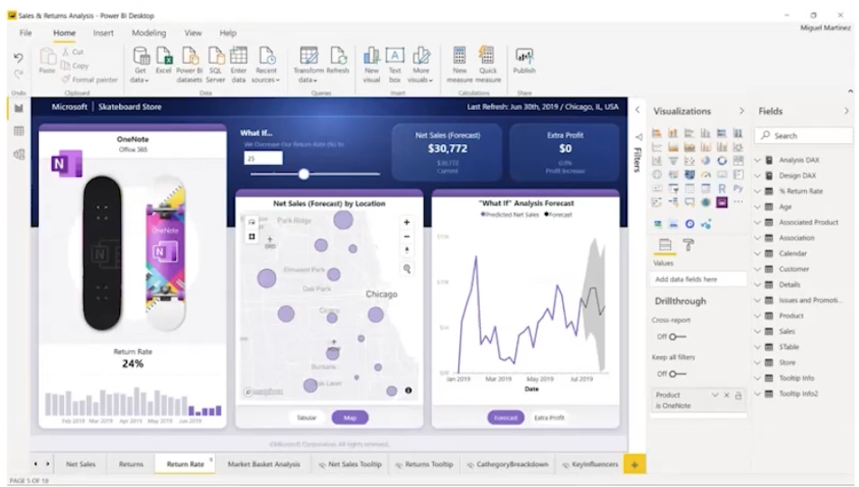
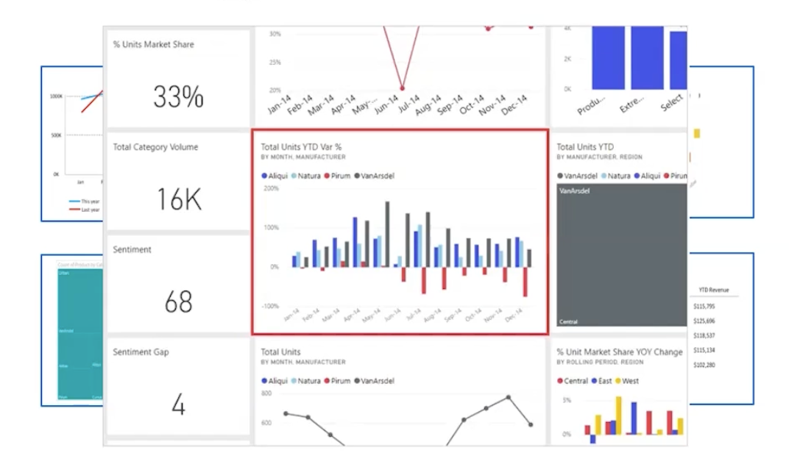

# Explorando data warehouse - 689672176

# Explorando analytics em larga escala - 691344950

# Power BI - 691346089

O Power BI é uma ferramenta de visualização de dados que permite criar relatórios e dashboards interativos. 

Ele se conecta a diversas fontes de dados, incluindo bancos de dados relacionais, não relacionais e serviços na nuvem.

Podemos centralizar os dados em um único local, facilitando a análise e a tomada de decisões.

## Como podemos utilizar? 

Podemos usar o Power BI Desktop, mesmo que não tenhamos o Office 365

A partir do momento que criamos um relatório no Power BI Desktop, podemos publicá-lo no serviço do Power BI na nuvem, usando o Power BI Service.

Podemos visualizar os relatórios a partir de qualquer dispositivo, como computadores, tablets e smartphones.

Depois de publicar o relatório, podemos compartilhar com outras pessoas, permitindo que elas visualizem e interajam com os dados.

O Power BI App tem o objetivo de facilitar o acesso aos relatórios, e também podemos permitir compartilhar o datasets com outras pessoas.

