# AZ-700: Designing and Implementing Microsoft Azure Networking Solutions

## 2025-04-23

• Design and implement Azure VPN Gateway
• Exercise - Create and configure a Virtual Network Gateway
• Connect networks with Site-to-site VPN connections
• Connect devices to networks with Point-to-site VPN connections
• Connect remote resources by using Azure Virtual WANs
• Exercise - Create a Virtual WAN by using the Azure Portal
• Create a network virtual appliance (NVA) in a virtual hub

# Progress

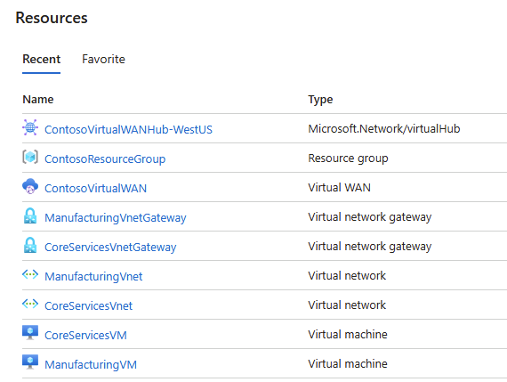

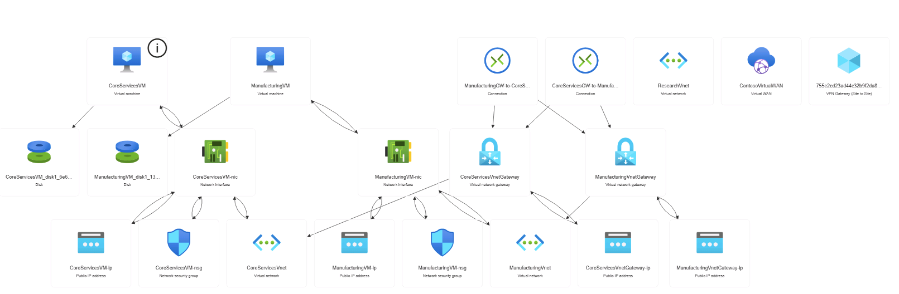

## VPN Gateway

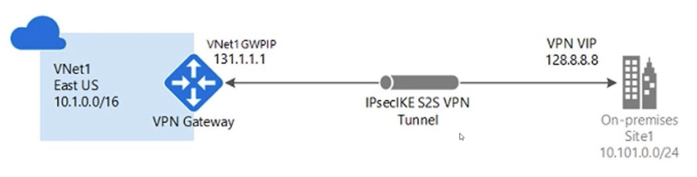

Gateway subnet é obrigatório na subnet

Local network gateway é a representação do router on-premises em Azure

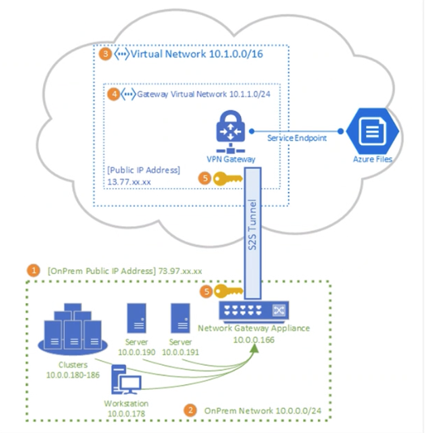

https://learn.microsoft.com/en-us/azure/vpn-gateway/vpn-gateway-about-vpn-devices

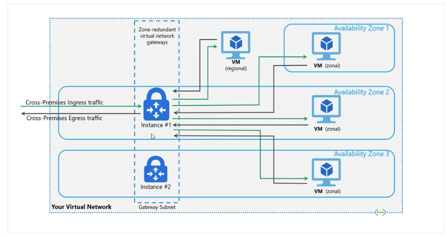

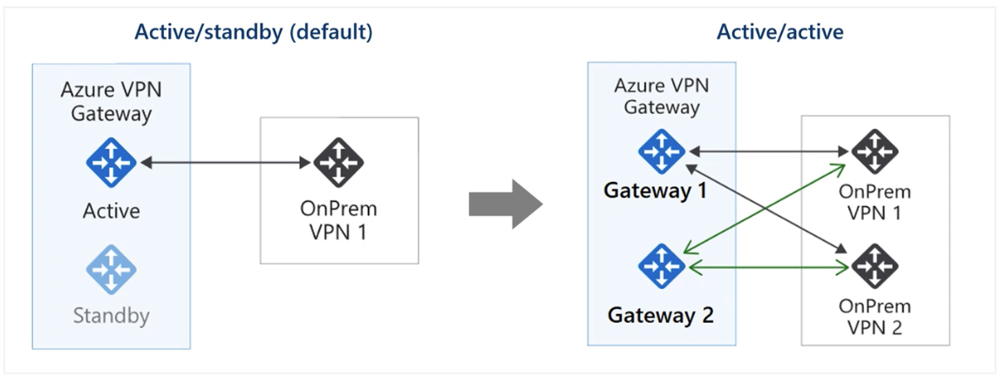

## Point to site protocols

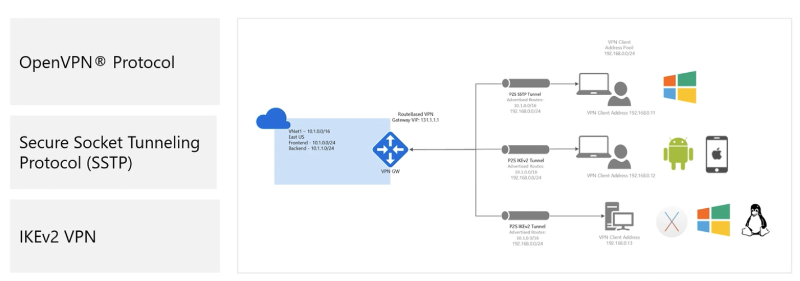

GPO, espalha por toda a empresa

Authentication methods: Azure certificate, RADIUS, Azure AD, etc

# Virtual WAN ( VWAN )

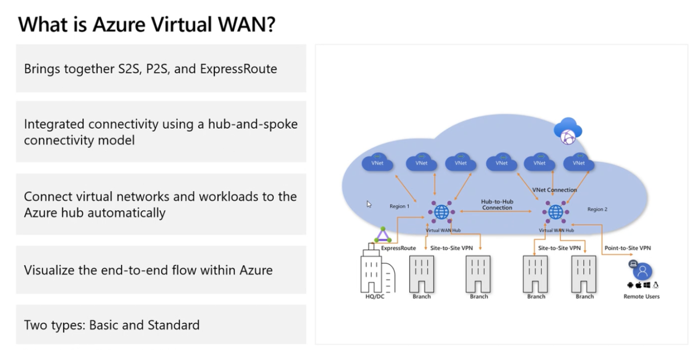

# Virtual Hub Routing

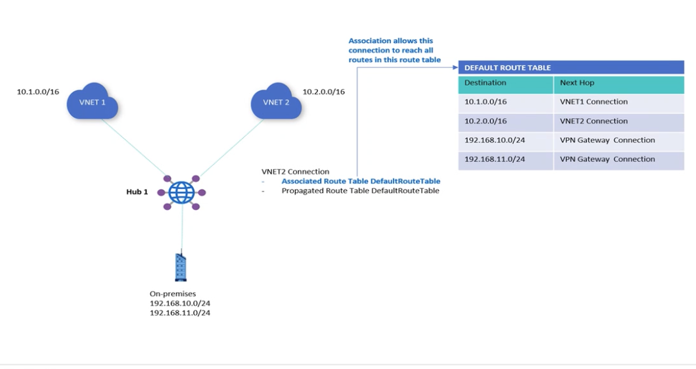

Connection são peerings

association é quando associamos uma route table com uma connection

propagation é quando propagamos as rotas para a connection

labels é uma nomenclatura para as rotas ( na tabela de rotas )
--> agrupador também

static routes são rotas que podem ser adicionadas manualmente

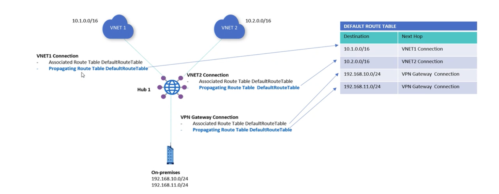

# NVA

Abstrai a complexidade de configuração VPN e network gateway

Capacidades:

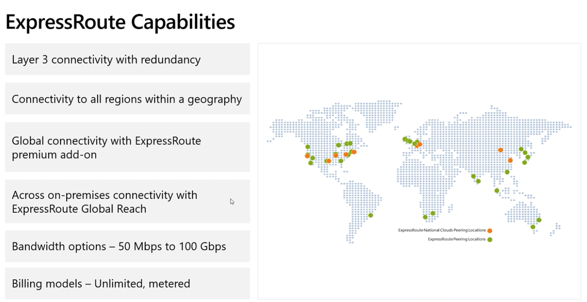

VPN vs ExpressRoute

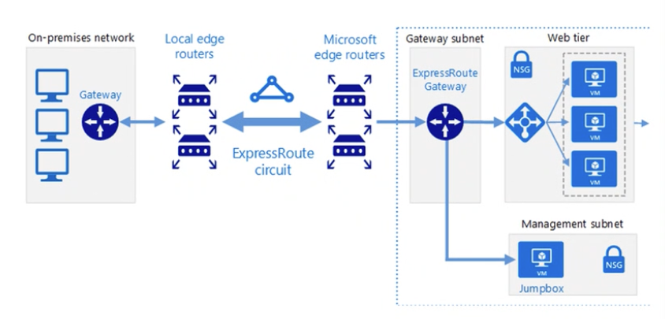

Benefícios:

• Conexões previsíveis, confiáveis e de alta taxa de transferência  
• Até 100 Gbps de largura de banda - suporta escalonamento dinâmico de largura de banda e acesso direto a clouds nacionais  
• Circuitos redundantes integrados  
• Integra-se com o Multiprotocol Label Switching (MPLS) existente  
• Até 99,95% de SLA de disponibilidade em toda a conexão  

Desafios:

• Trabalhar com um provedor de conectividade de terceiros  
• Requer roteadores de alta largura de banda no local  

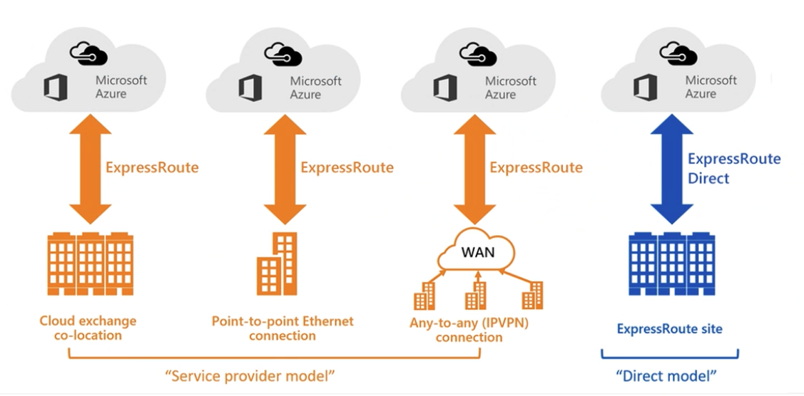

Dark fiber é um modelo de conectividade dedicado, onde o cliente aluga a fibra escura do provedor de telecomunicações e é responsável por gerenciar a rede.

Express Route Direct é um modelo de conectividade dedicado, onde o cliente tem um circuito dedicado entre o local e o ponto de presença do Azure.

### BFD

Bidirectional Forwarding Detection (BFD) é um protocolo de detecção de falhas de encaminhamento bidirecional que fornece detecção rápida de falhas em conexões de rede. Ele é usado para monitorar a conectividade entre dois dispositivos de rede, como roteadores ou switches, e detectar rapidamente falhas na conexão.

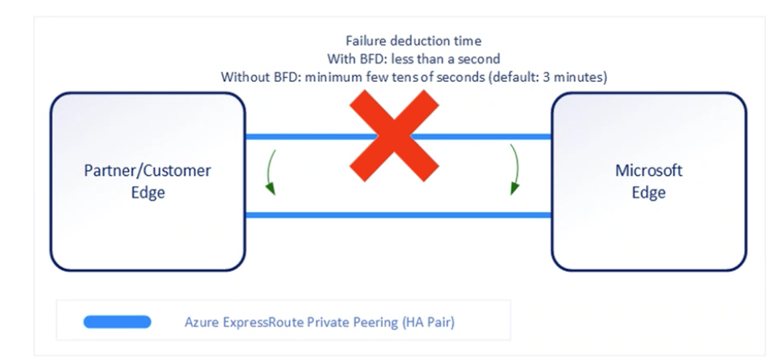

### Configure encryption over ExpressRoute

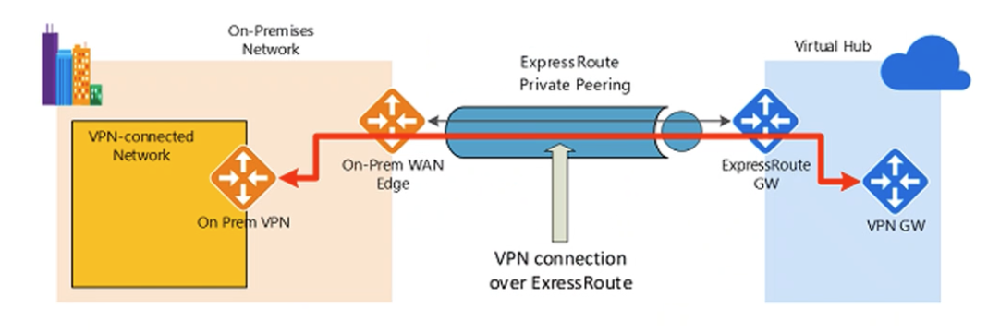

é possivel habilitar a criptografia em um circuito ExpressRoute

Utiliza vpn gateway, mas é possivel fazer mac sec

https://learn.microsoft.com/en-us/azure/expressroute/expressroute-howto-macsec

# Coexisting site to site and express route

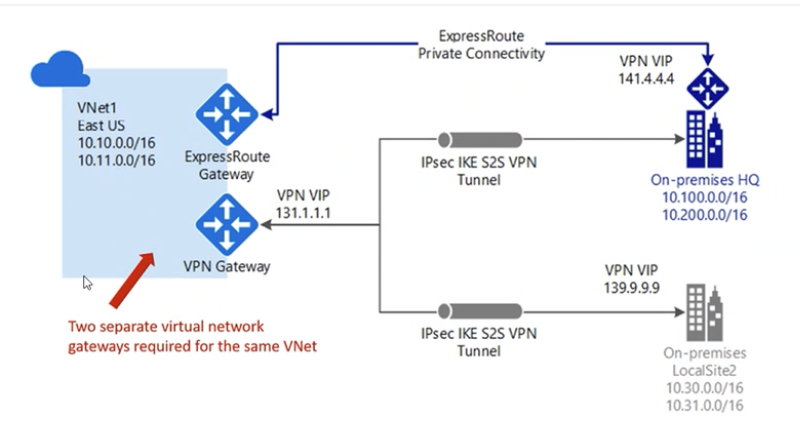

A azure usa por default usa o express route, é necessário on premise garantir que o express route seja prioritário. Quando falha, ai a VM tenta usar a VPN Gateway.

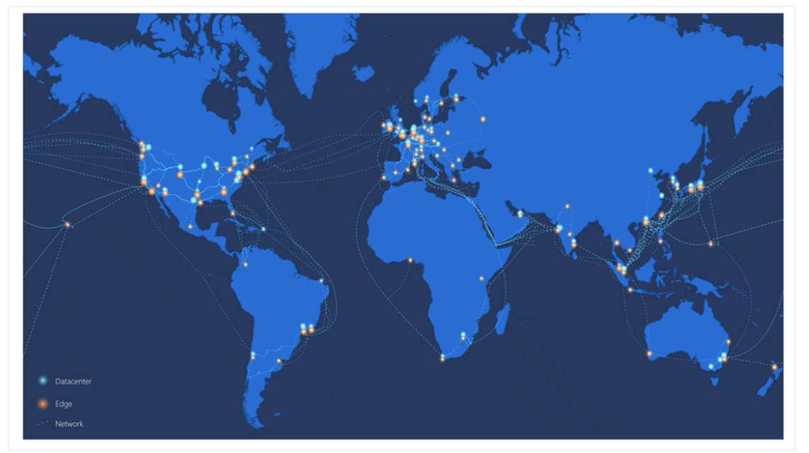

