# Resumo

• Get network security recommendations with Microsoft Defender for Cloud

• Deploy Azure DDos Protection by using the Azure portal

• Exercise - Configure DDoS Protection on a virtual network

• Deploy and configure Network Security Groups (NSG)

• Design and implement Azure Bastion

• Design and implement Azure Firewall

• Exercise - Deploy and configure Azure Firewall using the Azure portal

• Working with Azure Firewall Manager

• Exercise - Secure your virtual hub using Azure Firewall Manager

• Implement a Web Application Firewall

Microsoft Security e Compliences

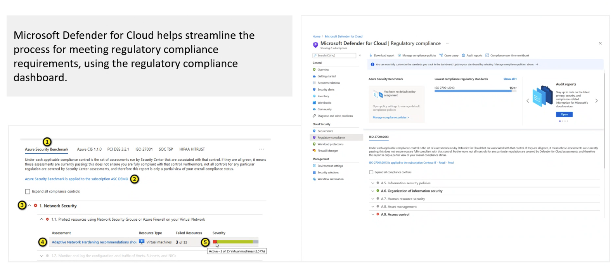

Vimos também alertas

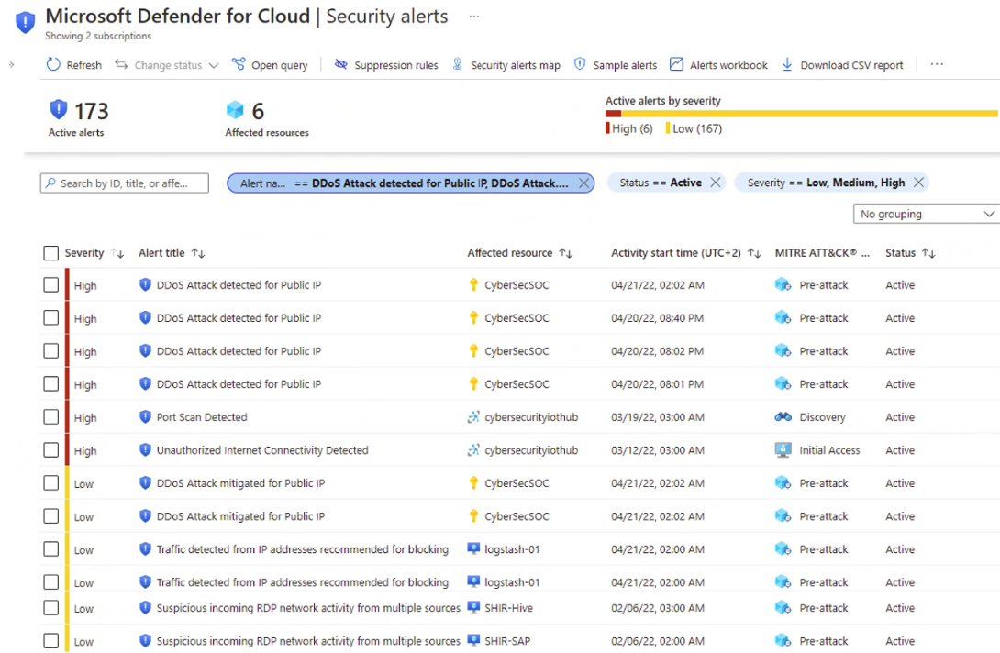

- Volumetria

FLood de UDP

- Ataques de protocolos

O ataque foca em nunca fazer o handshake, e deixar a ligação up, e explora que no TCP faz o SYN, a nunca manda o ACK novamente.

- Ataque em camada de serviço

Violação do protocolo HTTP, SQL injection, Cross site scription e outros 7 ataques.

## Azure DDoS protection tiers

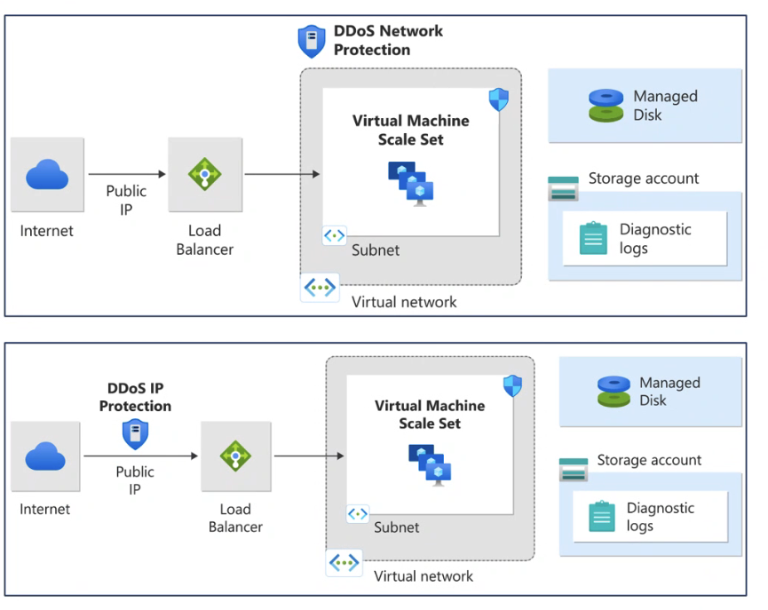

https://learn.microsoft.com/en-us/azure/ddos-protection/ddos-protection-sku-comparison

### Features

- Sempre monitorando

- Adaptative real time tuning
-- um algoritmo que vai aprender sobre o tráfego, e vai aprender o baseline. Então consegue identificar DDoS

- DDoS analytics, métricas e alertas

- Mitigação em escala

Meus testes:

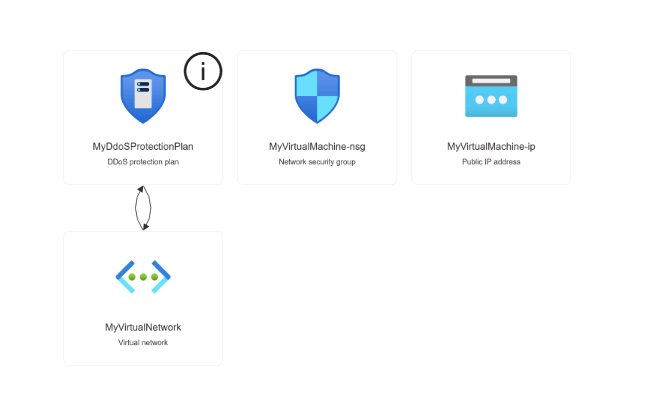

Os NSGs são avaliados de forma independente para o subnet e a NIC.

Uma regra de "permitir" deve existir em ambos os níveis para que o tráfego seja admitido.

Use o link "Regras Efetivas" se não tiver certeza de quais regras de segurança estão sendo aplicadas.

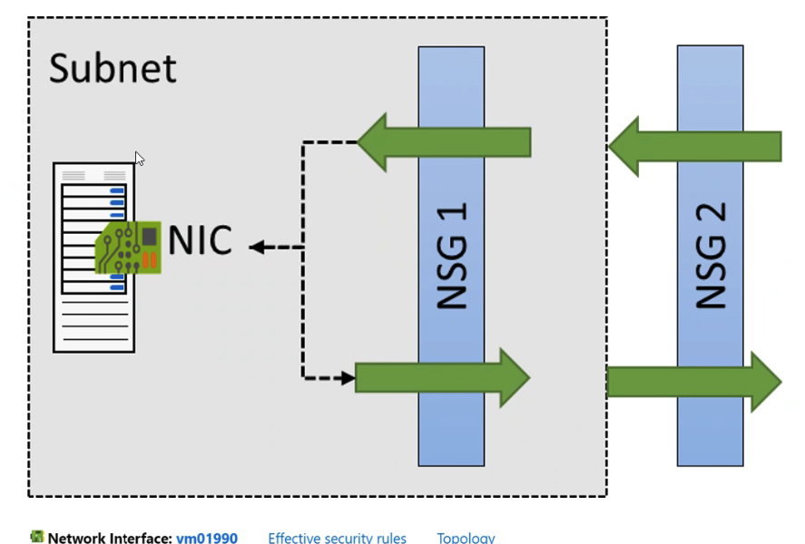

Podemos usar Service Tag para definir acesso, e acessar igual ao Docker.

por exemplo pra um serviço que ta sempre trocando Ips, e pode acessar via destination.

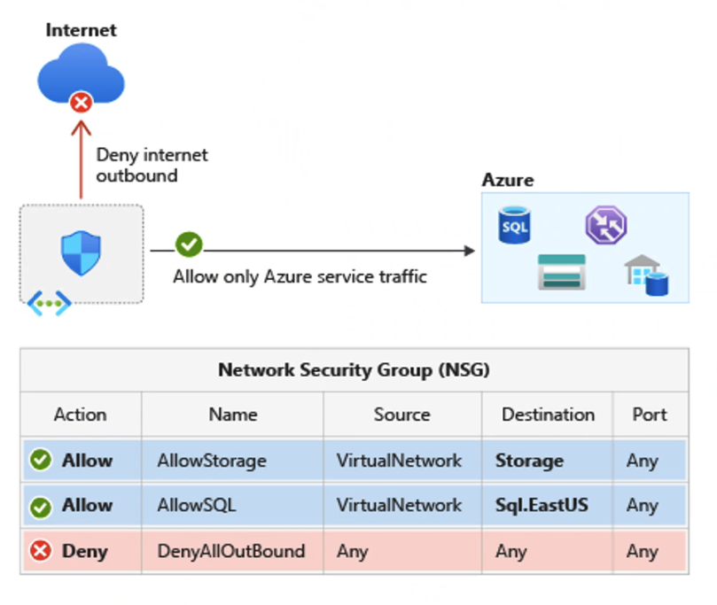

https://learn.microsoft.com/azure/virtual-network/service-tags-overview

# Application Security Group (ASG)

Configurar ASG como uma extensão natural da estrutura de um aplicativo  

ASG pode ser a origem e o destino em uma regra de segurança  

Todos os NIC atribuídos a um ASG devem existir na mesma rede virtual em que o primeiro NIC atribuído ao ASG está se você especificar um ASG como origem e destino em uma regra de segurança, o NIC em ambos os ASG deve existir na mesma rede virtual  

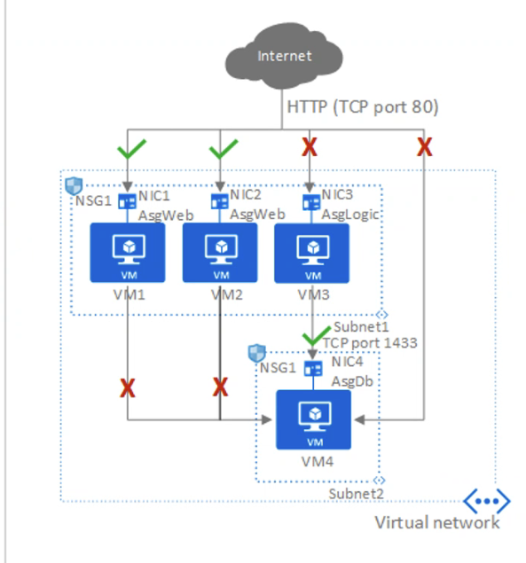

VMs via Bastion

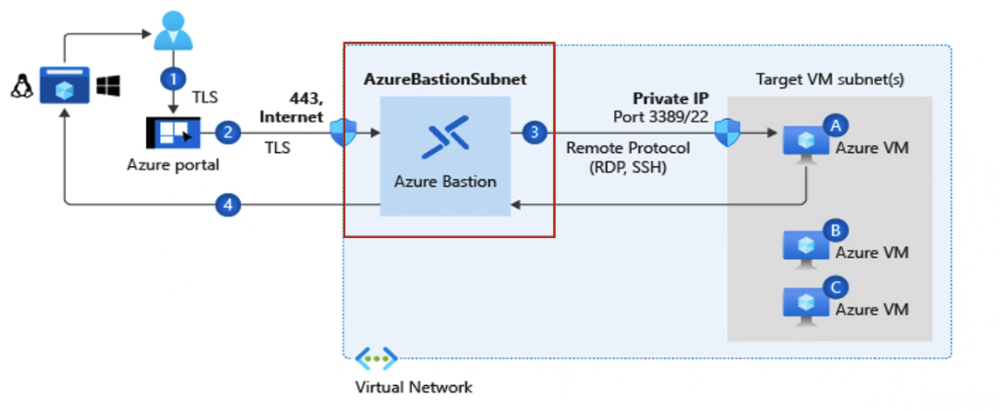

# Azure Firewall

NVA default da azure

é um firewall, pode ser usado como Router.

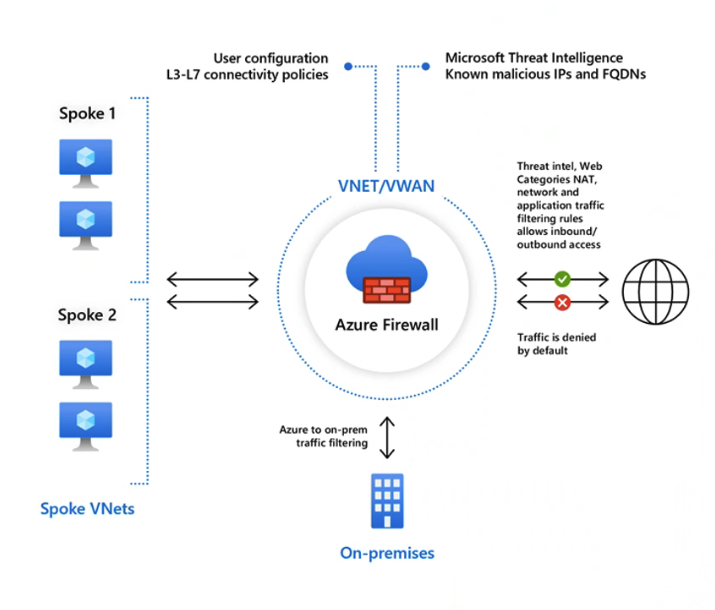

Azure firewall é escalável muitas vezes mais que uma NVA.

Não é uma WAF

Firewall com estado como serviço  
Alta disponibilidade integrada com escalabilidade ilimitada na nuvem  

Crie, aplique e registre políticas de conectividade de aplicativos e redes  

Filtragem baseada em inteligência contra ameaças para L3-L7  

Totalmente integrado com o Azure Monitor para registro e análise  

Suporte para conectividade híbrida por meio de implantação atrás de Gateways VPN e ExpressRoute  

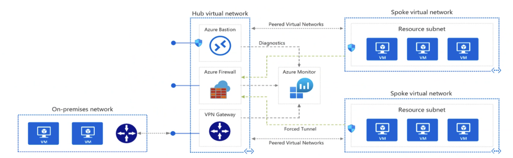

https://learn.microsoft.com/azure/architecture/reference-architectures/hybrid-networking/hub-spoke

Central Azure Firewall deployment and configuration
Hierarchical policies (global and local)

Integrated with third-party security-as-a-service for advanced security

Centralized route management

Region availability

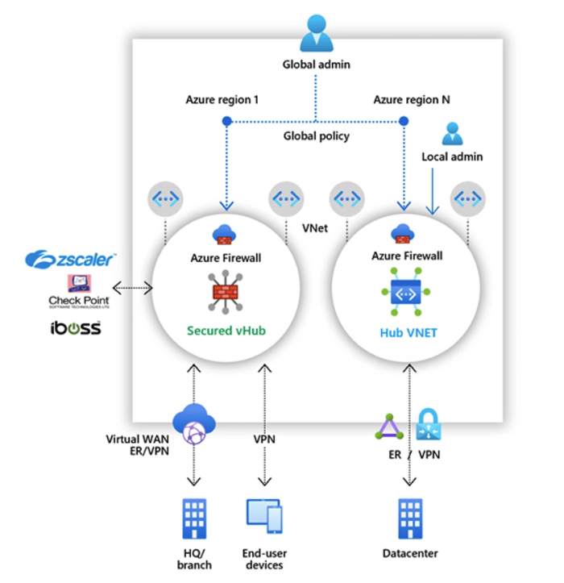

WAF

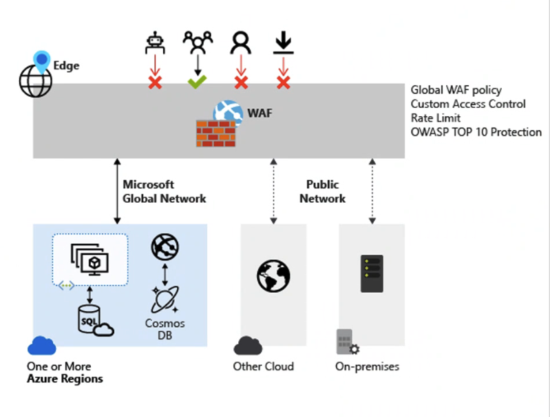

Default rule sets –
https://learn.microsoft.com/azure/web-application-firewall/afds/waf-front-door-drs?tabs=drs21#default-rule-sets
 
Core rule sets –
https://learn.microsoft.com/azure/web-application-firewall/ag/application-gateway-crs-rulegroups-rules?tabs=drs21#core-rule-sets

Azure Web Application Firewall DRS rule groups and rules | Microsoft Learn

Learn about the Azure Web Application Firewall Default Rule Set (DRS) rule groups and rules on Azure Front Door.

# Monitoring

• Monitor your networks using Azure Monitor

• Exercise - Monitor a load balancer resource using Azure Monitor

• Use Azure Network Watcher to troubleshoot and analyze your network

Metricas de tempo real

Logs do que já aconteceu

Talvez você queira:

- Bandwidth
- Packets por segundos
- Conexões abertas
