# AZ-700: Designing and Implementing Microsoft Azure Networking Solutions

## 2025-04-21

- Apresentação

O curso vai até 15 de setembro

APE AZ-305 -> Preparação para certificação

Vamos depois Criar projeto, e ter avaliação (Certificação Rumos Expert)

Vamos fazer a certificação Microsoft

DP 900 => E Learning => 9 a 23/junho ( por causa do feriado )

AZ 500 => 2 a 21 de junho

No CRE, o formador vai dar problemas, e vamos ter que resolver.

## Marcação de exame

Vamos marcar o exame da Microsoft, podemos fazer na Rumos em lisboa

Vou ter second shot sem custo

## Aulas

18:45 até 22:15

intervalo as 21h

## Começando com o formador

### Virtual Networks

• Explore Azure Virtual Networks
• Configure Public IP addresses
• Exercise: Design and implement a Virtual Network in Azure
• Design name resolution for your Virtual Network
• Exercise: Configure DNS settings in Azure
• Enable Cross-VNet connectivity with peering
• Exercise: Connect two Azure Virtual Networks using global virtual network peering
• Implement virtual network traffic routing
• Configure internet access with Azure Virtual NAT

Usamos VNET para falar entre os recursos

Existe alguns IPs que são reservados pela azure

-> Refs

Azure Virtual Network concepts and best practices –
https://learn.microsoft.com/azure/virtual-network/concepts-and-best-practices
 
Allocation method –
https://learn.microsoft.com/azure/virtual-network/ip-services/private-ip-addresses#allocation-method

Pode ter subnets para database, outro para webserver, outra pode ser VMs para monitorização, etc...

se vc tiver uma VPN gateway, por exemplo, você precisa reservar ter GatewaySubnet da azure.

[NFX para firewall ?]

### Endereços privados

É muito raro IPs dynamic mudar.

Add, change, or delete a virtual network subnet –
https://learn.microsoft.com/azure/virtual-network/virtual-network-manage-subnet?tabs=azure-portal

Microsoft global network –
https://learn.microsoft.com/azure/networking/microsoft-global-network

Podemos linkar VNET em várias regiões, mas o IP não pode fazer overlap.

-- Virtual network encryption
-- Azure Firewall
-- Azure Bastian

Simulação

https://mslabs.cloudguides.com/guides/AZ-700%20Lab%20Simulation%20-%20Design%20and%20implement%20a%20virtual%20network%20in%20Azure

#### Endereços públicos

é um recursos a parte, e não tem dependencia a VNET

-> Standard SKU

- IP sempre estático

- seguro por default ( vai bloquear tudo, e precisa fazer explicit allow )

- pode ser assigned 

- Na disponibilidade de zona: pode ser sem zona, ou em alguma zona

Create, change, or delete IP addresses - 
https://learn.microsoft.com/azure/virtual-network/ip-services/virtual-network-public-ip-address
Create, change, or delete an Azure public IP address - Azure Virtual Network | Microsoft Learn
Manage public IP addresses. Learn how a public IP address is a resource with configurable settings.
 
# Custom IP Address

Alguns use cases, por exemplo, que clientes pode ter IP próprio, e regras, pode adicionar

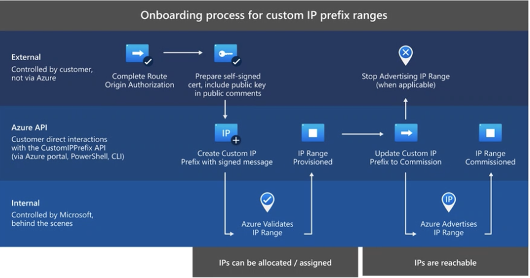

Custom IP address prefix (BYOIP) - Azure Virtual Network - https://learn.microsoft.com/azure/virtual-network/ip-services/custom-ip-address-prefix
 
Manage a custom IP address prefix –
https://learn.microsoft.com/azure/virtual-network/ip-services/manage-custom-ip-address-prefix

Design 

### Exercícios

• Create a virtual network in the portal
• Create a virtual network with PowerShell

# DNS

São globais, Tem 4 Nameserver

Azure DNS Zones

Pode criar várias zonas com mesmo nome

Se por exemplo tenho ja tenho um dominio, posso delegar o dominio ao Azure, e então vou gerir os DNS lá.

Delegation of DNS zones with Azure DNS - https://learn.microsoft.com/azure/dns/dns-domain-delegation
 
Host your domain on Azure DNS - https://learn.microsoft.com/training/modules/host-domain-azure-dns/
 
Delegate a domain to Azure DNS. –
https://learn.microsoft.com/azure/dns/dns-delegate-domain-azure-dns
 
Tutorial: Host your domain in Azure DNS –
https://learn.microsoft.com/azure/dns/dns-delegate-domain-azure-dns

### Records Sets

A, AAAA, CAA, CNAME, etc...

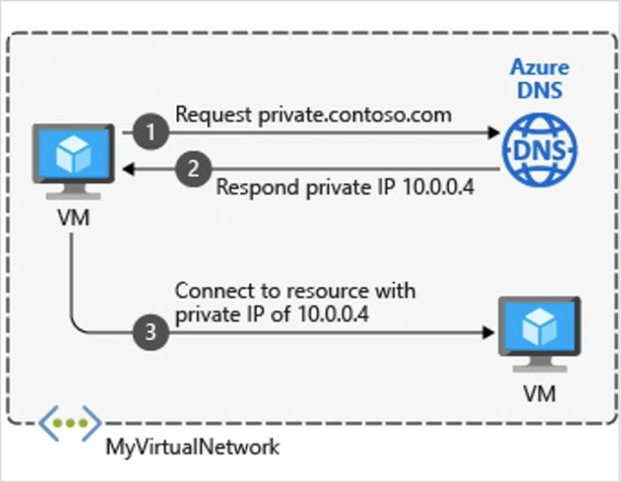

Obrigatoriamente, precisa linkar a VNET

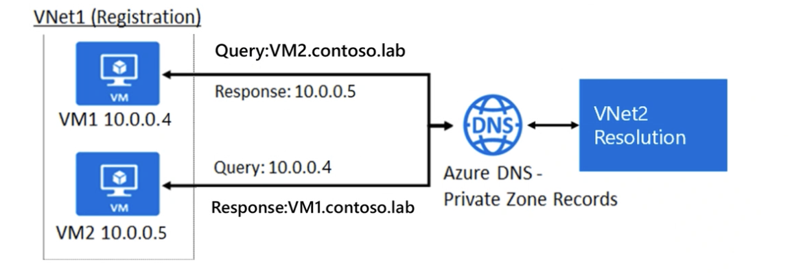

Private DNS zone

O endereço 168.... da Azure, só responde a endereço da azure

OBS:
pra conectar on premise, só via VPN

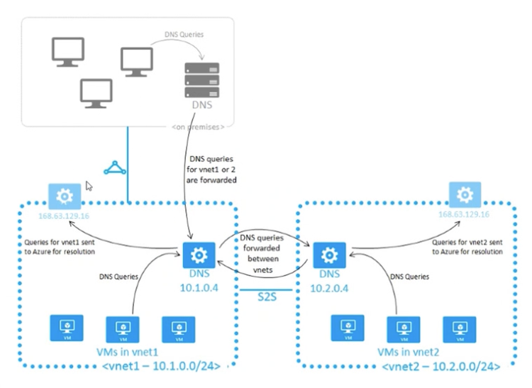

### Exercícios

- Criar um DNS zone

https://mslabs.cloudguides.com/guides/AZ-700%20Lab%20Simulation%20-%20Configure%20DNS%20settings%20in%20Azure

Até aqui, eu misturei conceitos de Private DNS e global DNS

Então, consegui tirar muitos das minha duvidas.

Tipo, eu posso dizer que meu DNS é google.com, mas como estou em private DNS, não vai ficar verificando globalmente. 

Praticamente, esse Privates DNS Zones é um PaaS.

# VNet Peering

Imagina que quero comunicar entre Microsft e SAP, pode fazer peering direto com VNet ou VPN

Posso deixar que a VNet 1 fale com a VNet 2, mas não deixar a VNet 2 falar com a VNet 1

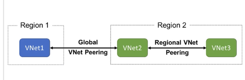

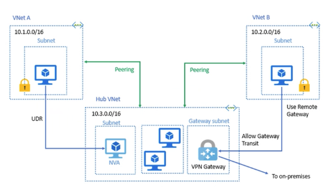

se fosse entre duas empresas, precisa ter um user autorizado para ter acesso ao peering do outro lado.

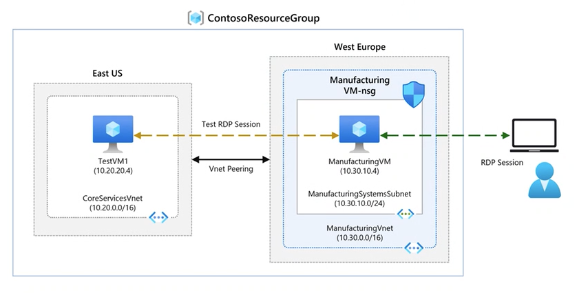

# Custom Routing

• Virtual network traffic routing
• Configure User-defined routes (UDRs)
• Configure forced tunneling
• Configure Azure Route Server
• Diagnose a routing problem
• Demonstration
• Learning Recap

As rotas por default, as maquinas tem acesso a todos recursos. ( Virtual Net local -> System routes )

as vms tem sempre uma rota pra chegar a internet

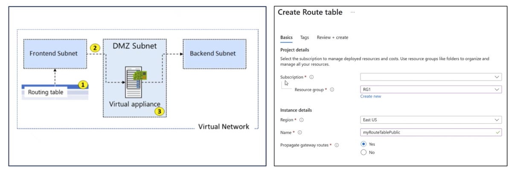

Propagar gateway routes: Se eu selecionar não, posso já cortar com que faça advertise

Next Hope Type:

Virtual appliance é uma VM especializada ( Load balancer, Router )

Sempre associamos a VM a subnet

# Forced tunneling

Posso controlar o que vai sair para internet, passando sempre em um local especifico antes.

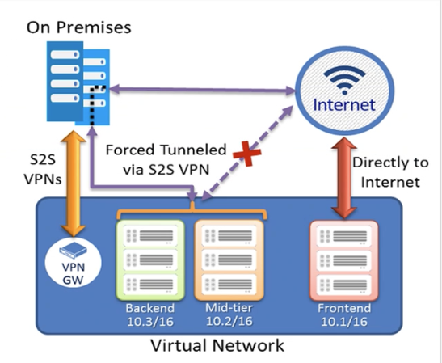

# Router Server

Serve para receber rotas dinamicas, e propagar para as VNETs

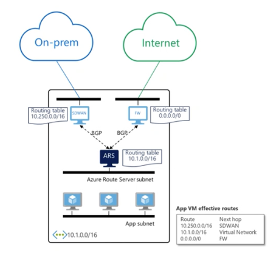

- SDWAN

-- VPN 1 x muitos

isso é um use case para milhares de rotas

# NAT

• Azure Virtual Network NAT
• Choose when to use a Virtual Network NAT
• Coexistence of inbound and outbound
• How to deploy NAT
• Demonstration
• Learning Recap

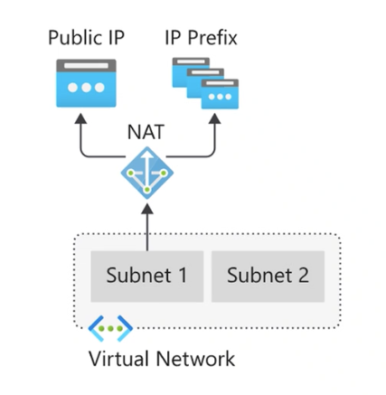

Azure NAT Gateway serve para outbound

O Load balancer da inbound e outbound, mas não vai para ir a internet. 

O DNS aponta para o load balancer, e depois o load balancer vai para o NAT Gateway

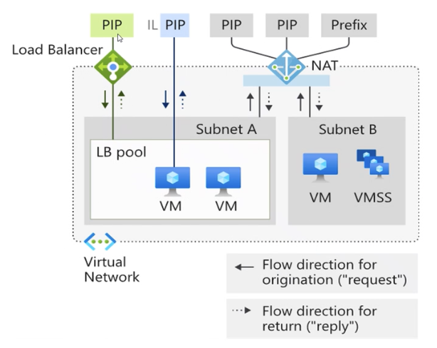

